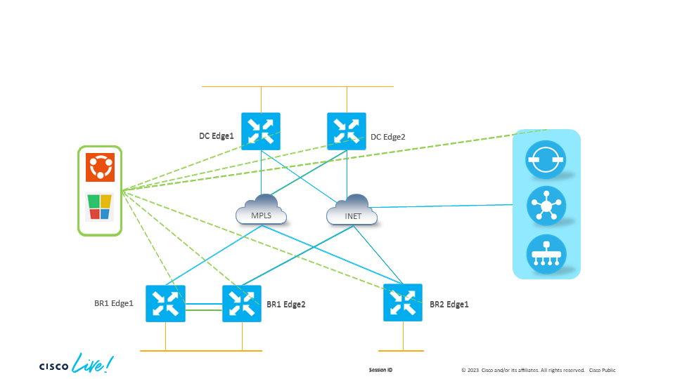
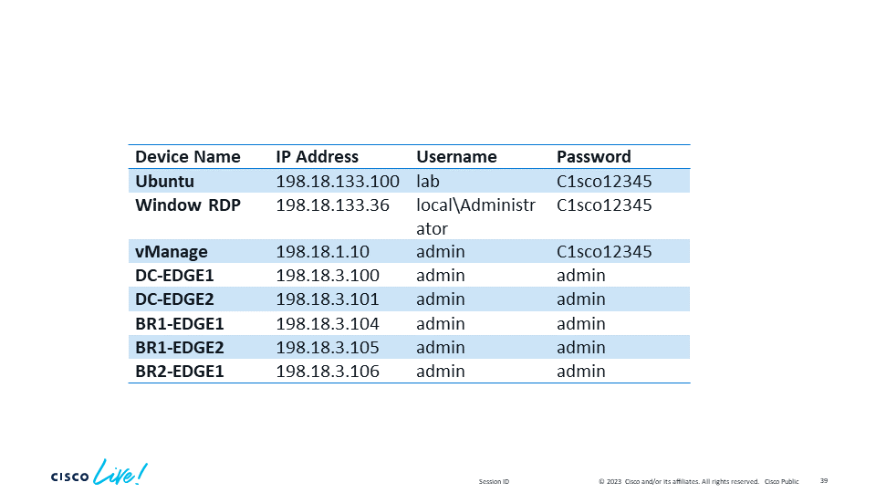

# Table of Content

* [Task 0 Setup the Ubuntu Environment](#task-0-setup-the-ubuntu-environment)
* [Setting up Python Automation Environment](#setting-up-python-automation-environment)
* [Task 1 REST API with CURL](/Task%201%20Curl/Task1.md)
* [Task 2 REST API with Swagger](/Task%202%20Swagger/Task2.md)
* [Task 3 REST API with POSTMAN](/Task%203%20Postman/Task3.md)
* [Task 4 REST API with Python](/Task%204%20Python/Task4.md)
* [Task 5 Using Ansible with SDWAN C-EDGEs](/Task%205%20Ansible%20Edge/Task5.md)
* [Task 6 Using Ansible with SDWAN vManage](/Task%206%20Ansible%20SDWAN/Task6.md)
* [Task 7 SDWAN Monitoring with Webhook](/Task%207%20Monitoring/Task7.md)

## Learning Objectives

Upon completion of this lab, you will be able to:

1. Clearly describe the merits of using CURL, Postman, Python and Ansible for API based interactions.
2. Gained a starting point for the use of API based interactions with SDWAN in your lab and/or production network.
3. Understand which tool should be applied in which context.

Disclaimer
This training document is to familiarize with the Cisco SDWAN REST APIs. Although the lab design and configuration examples could be used as a reference, it’s not a real design, thus not all recommended features are used, or enabled optimally. For the design related questions please contact your representative at Cisco to engage your account SE, a Cisco partner or Cisco Professional Services (CX) to support you further with your journey.

## Scenario

In this lab activity, you will learn about the REST APIs provided by vManage and various methods to interact with it using programmability-based techniques.

The lab environment consists of five virtual SDWAN C-Edge nodes, which are managed and orchestrated via virtual vManage, vSmart and vBond instances.

The Wide Area network depicted in the network diagram below, shows connectivity between DC and Branch sites connecting over different handoffs, the blue links representing the MPLS and internet networks.

To provide manageability of the network, an Ubuntu and Windows workstation provided.

The forthcoming programmability tasks outlined in this lab shall use a mix of operating systems to achieve the respective exercises.

## Network Diagram



## Device Details



```Dcloud VPN Credentials will be shared by the instructors```


## Task 0: Setup the Ubuntu Environment

Login to the Ubuntu Matchine, IP and Credentials above.

Install all the needed linux packages for establishing SD-WAN network automation environment.

```code
sudo apt update
sudo apt install -y git vim 
sudo apt install python3-pip -y
sudo pip3 install --upgrade pip
```

Please check the version of Python installed on your system.

```code
python3 -V
python3 --version
```

Ensure the version 3.8.10 or above

## Setting up Python Automation Environment

We will install all the required packages in this task

```code
vim requirements.txt 
```

Copy the below packages

```code
ansible==6.7.0
ansible-core==2.13.7
ansible-pylibssh==1.1.0
certifi==2019.3.9
chardet==3.0.4
click==8.1.3
et-xmlfile==1.0.1
Flask-BasicAuth==0.2.0
Flask==2.2.2
idna==2.8
itsdangerous==2.1.2
jdcal==1.4.1
Jinja2==3.1.2
MarkupSafe==2.1.2
napalm==4.0.0
ncclient==0.6.13
netmiko==4.1.2
nornir==3.3.0
nornir-ansible==2022.7.30
nornir-jinja2==0.2.0
nornir-napalm==0.3.0
nornir-netmiko==0.2.0
nornir-scrapli==2021.7.30
nornir-utils==0.2.0
numpy==1.19.0
openpyxl==3.0.4
pandas==1.0.1
paramiko==2.7.2
pyaml==20.4.0
python-dateutil==2.8.1
pytz==2020.1
requests==2.21.0
requests-toolbelt==0.9.1
six==1.15.0
tabulate==0.8.10
urllib3==1.24.3
Werkzeug==2.2.2
xmltodict==0.13.0
json2html==1.3.0
viptela==0.3.9
```

Run the following command

```code
python3 -m pip install -r requirements.txt
```

To find out the version of an installed package, use

```code
pip freeze
```
