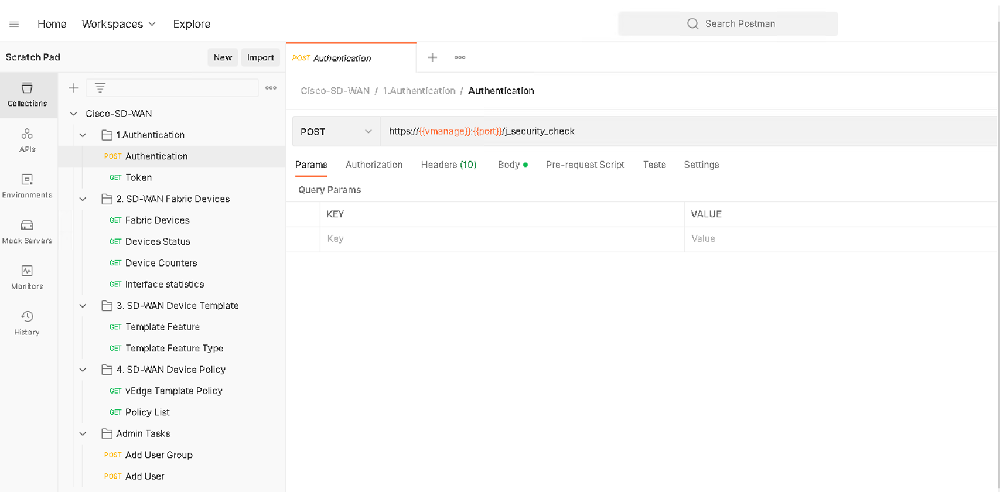
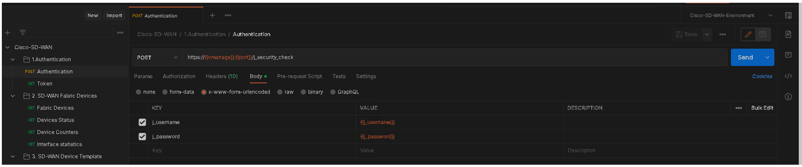
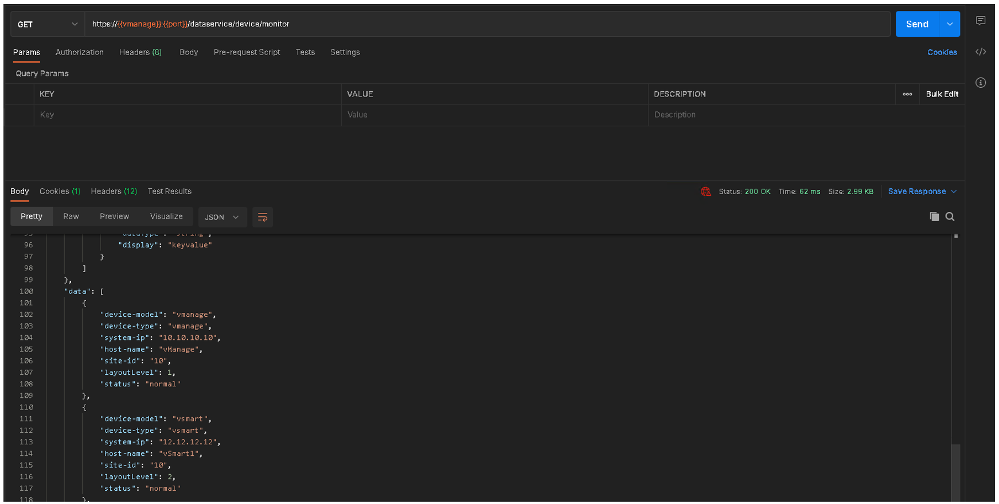
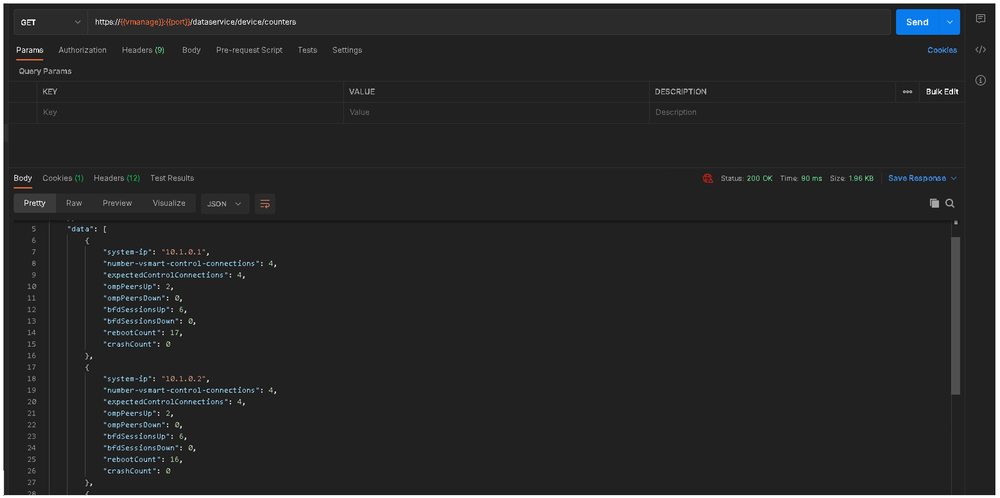
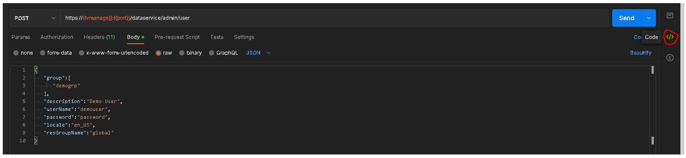
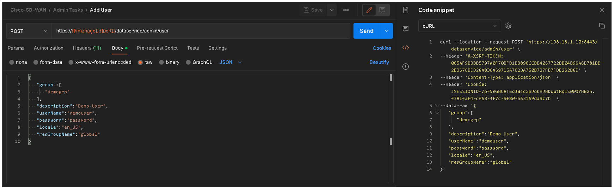
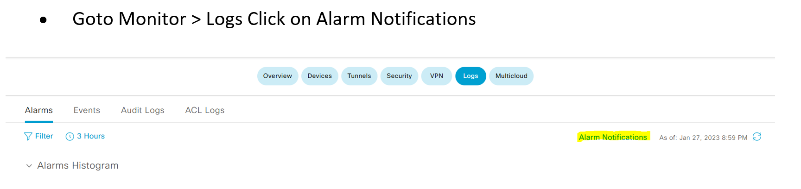
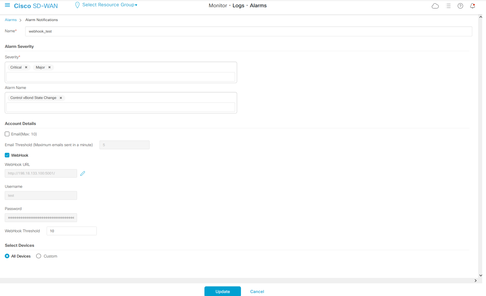
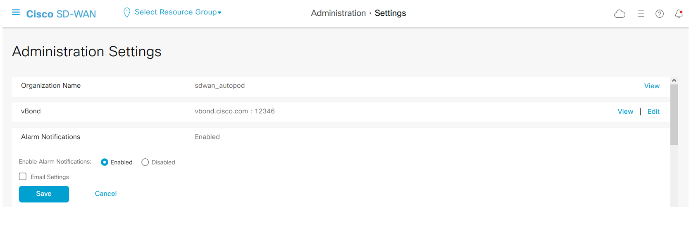
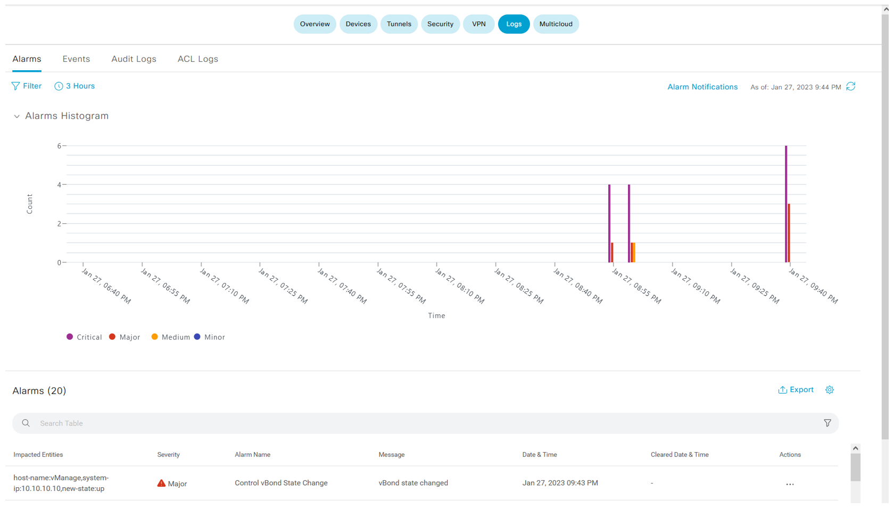

# Table of Content

* [Task 0 Setup the Ubuntu Environment](#task-0-setup-the-ubuntu-environment)
    * [Setting up Python Automation Environment](#setting-up-python-automation-environment)
* [Task 1: Rest API with CURL ](#task-1-rest-api-with-curl)
    * [ Step 1: Log In](#step-1-log-in)
    * [ Step 2: Get a list of Devices](#step-2-get-a-list-of-devices)
* [Task 3: Rest API with Postman](#task-3-rest-api-with-postman)
    * [ Step 1: Postman Configuration](#step-1-postman-configuration)
    * [ Step 2: Authentication](#step-2-authentication)
    * [ Step 3: API Cross-Site Request Forgery Prevention](#step-3-api-cross-site-request-forgery-prevention)
    * [ Step 4: GET SD-WAN Fabric Devices](#step-4-get-sd-wan-fabric-devices)
    * [ Step 5: GET SD-WAN Devices Status](#step-5-get-sd-wan-devices-status)
    * [ Step 6: GET SD-WAN Devices Counters](#step-6-get-sd-wan-devices-counters)
    * [ Step 7: GET SD-WAN Interface Statistics](#step-7-get-sd-wan-interface-statistics)
    * [ Step 8: Add User Group](#step-8-add-user-group)
    * [ Step 9: Add User](#step-9-add-user)
    * [ Step 10: Generate code with Postman](#step-10-generate-code-with-postman)
* [Task 4: Rest API with Python](#task-4-rest-api-with-python)
    * [ Step 1: Authenticate](#step-1-authenticate)
    * [ Step 2: GET with Python](#step-2-get-with-python)
        * [  GET Edge List](#get-edge-list)
        * [  GET Device and Template List ](#get-device-and-template-list)
        * [  Get Template Variable List](#get-template-variable-list)
    * [ Step 3: POST with Python](#step-3-post-with-python)
        * [  Change device hostname ](#change-device-hostname)
        * [Add vMange Usergroup ](#add-vmange-usergroup)
    * [Step 4: SDWAN Policies with Python](#step-4-sdwan-policies-with-python)
        * [Get Policy List](#get-policy-list)
        * [Activate Policy](#activate-policy)
        * [Deactivate Policy](#deactivate-policy)
   * [Optional Task](#optional-task)
* [Task 5: Using Ansible with SDWAN C-EDGEs](#task-5-using-ansible-with-sdwan-c-edges)
    * [Step 1: Verify the status of the Ansible Installation](#step-1-verify-the-status-of-the-ansible-installation)
    * [Step 2: Create a new ansible.cfg file for your automation](#step-2-create-a-new-ansiblecfg-file-for-your-automation)
        * [Configuration selection order:](#configuration-selection-order)
        * [Configuration file format:](#configuration-file-format)
        * [Navigate to the directory:](#navigate-to-the-directory)
    * [Step 3: Creating your Inventory](#step-3-creating-your-inventory)
        * [INI File Format](#ini-file-format)
        * [Creating an INI Inventory File for the Lab](#creating-an-ini-inventory-file-for-the-lab)
    * [Step 4: Node Variables](#step-4-node-variables)
        * [Inline within Inventory File](#inline-within-inventory-file)
        * [Group Based Variables in Inventory](#group-based-variables-in-inventory)
    * [Step 5: Executing an Ad-Hoc Task](#step-5-executing-an-ad-hoc-task)
    * [Step 6: Deploying your first playbook](#step-6-deploying-your-first-playbook)
        * [Create Directory Structure For Playbooks](#create-directory-structure-for-playbooks)
        * [Creating your first Playbook](#creating-your-first-playbook)
        * [Adding your first Plays](#adding-your-first-plays)
* [Task 6: Using Ansible with SDWAN vManage](#task-6-using-ansible-with-sdwan-vmanage)
    * [Step 1: Download Custom Ansible SDWAN Modules](#step-1-download-custom-ansible-sdwan-modules)
        * [Instructing Ansible to use custom Modules](#instructing-ansible-to-use-custom-modules)
    * [Step 2: Prepare a the inventory for vManage](#step-2-prepare-a-the-inventory-for-vmanage)
        * [vManage Variables](#vmanage-variables)
    * [Step 3: Create a Playbook for vManage](#step-3-create-a-playbook-for-vmanage)
        * [Executing the playbook](#executing-the-playbook)
* [Task 7: SDWAN Monitoring with webhooks](#task-7-sdwan-monitoring-with-webhooks)
    * [Step 1: Confiugre vManage](#step-1-confiugre-vmanage)
    * [Step 2: Enable Webhook Server](#step-2-enable-webhook-server)
    * [Step 3: Start Webhook Server](#step-3-start-webhook-server)


## Learning Objectives 
Upon completion of this lab, you will be able to: 

1.	Clearly describe the merits of using CURL, Postman, Python and Ansible for API based interactions. 
2.	Gained a starting point for the use of API based interactions with SDWAN in your lab and/or production network. 
3.	Understand which tool should be applied in which context. 

Disclaimer
This training document is to familiarize with the Cisco SDWAN REST APIs. Although the lab design and configuration examples could be used as a reference, it’s not a real design, thus not all recommended features are used, or enabled optimally. For the design related questions please contact your representative at Cisco to engage your account SE, a Cisco partner or Cisco Professional Services (CX) to support you further with your journey. 

## Scenario 
In this lab activity, you will learn about the REST APIs provided by vManage and various methods to interact with it using programmability-based techniques. 

The lab environment consists of five virtual SDWAN C-Edge nodes, which are managed and orchestrated via virtual vManage, vSmart and vBond instances. 

The Wide Area network depicted in the network diagram below, shows connectivity between DC and Branch sites connecting over different handoffs, the blue links representing the MPLS and internet networks.

To provide manageability of the network, an Ubuntu and Windows workstation provided. 

The forthcoming programmability tasks outlined in this lab shall use a mix of operating systems to achieve the respective exercises. 

## Network Diagram 


 


## Device Details 


```Dcloud VPN Credentials will be shared by the instructors  ```


# Task 0: Setup the Ubuntu Environment 

Install all the needed linux packages for establishing SD-WAN network automation environment.

```
sudo apt update
sudo apt install -y git vim 
sudo apt install python3-pip -y
sudo pip3 install --upgrade pip
```
Please check the version of Python installed on your system.
```
python3 -V
python3 --version
```
Ensure the version 3.8.10 or above

## Setting up Python Automation Environment

We will install all the required packages in this task 

```
vim requirements.txt 
```
Copy the below packages 
```
ansible==6.7.0
ansible-core==2.13.7
certifi==2019.3.9
chardet==3.0.4
click==8.1.3
et-xmlfile==1.0.1
Flask-BasicAuth==0.2.0
Flask==2.2.2
idna==2.8
itsdangerous==2.1.2
jdcal==1.4.1
Jinja2==3.1.2
MarkupSafe==2.1.2
napalm==4.0.0
ncclient==0.6.13
netmiko==3.4.0
nornir==3.3.0
nornir-ansible==2022.7.30
nornir-jinja2==0.2.0
nornir-napalm==0.3.0
nornir-netmiko==0.1.2
nornir-scrapli==2021.7.30
nornir-utils==0.2.0
numpy==1.19.0
openpyxl==3.0.4
pandas==1.0.1
paramiko==2.7.2
pyaml==20.4.0
python-dateutil==2.8.1
pytz==2020.1
requests==2.21.0
requests-toolbelt==0.9.1
six==1.15.0
tabulate==0.8.10
urllib3==1.24.3
Werkzeug==2.2.2
xmltodict==0.13.0
json2html==1.3.0
```
Run the following command 
```
python3 -m pip install -r requirements.txt
```
To find out the version of an installed package, use
```
pip feeze
```


# Task 1: Rest API with CURL 

cURL: Linux command line application.

https://curl.se/

Curl has an extensive command line syntax, and being an open source project, is heavily used by developers within the field. 

To begin with this task, we are going to follow a number of steps to familairize you with cURL and its operations. 

In the first step, we are simply going to login to a vManage server via a API POST call, and retrieve the JSESSIONID cookie, this cookie will be used within subsequent steps. 
## Step 1: Log In
•	Before using various REST APIs, you must first log in to vManage. 
•	Specifically, execute as follows. 
•	A successful login saves the JSESSIONID in a cookie.
```
curl --insecure \
     --location \
     --request POST "https://198.18.1.10/j_security_check" \
     --header "Content-Type: application/x-www-form-urlencoded" \
     --data "j_username=admin&j_password=C1sco12345" \
     --cookie-jar cookie.txt
```
From the above execution a few observations should be made from the CLI syntax. 

--insecure 

 This switch needs to be used in scenarios where the certificate may not be trusted. 

Such scenarios where this happens, is when a certificate is present on the device which is not from a public CA, or if a private CA is in use, and the server executing the request, does not consider the certificate as trusted.

--location 

<josh to update> 

--request

--header

--data

--cookie-jar

## Step 2: Get a list of Devices
As an example of REST API, let's try "Get device list"
```
curl --insecure \
     --location \
     --request GET "https://198.18.1.10/dataservice/device" \
     --cookie cookie.txt
```

Responses are returned in JSON format. To improve readability for humans, format it by piping it to python -m json.tool
```
curl --insecure \
     --location \
     --request GET "https://198.18.1.10/dataservice/device" \
     --cookie cookie.txt \
     | python -m json.tool
```


# Task 3: Rest API with Postman

## Step 1: Postman Configuration
A Postman environment is a list of variables that can be used to easily switch between different environments. By simply modifying the vManage username, password, port and hostname in the case of your environment, you can access and interact with different Cisco SD-WAN fabrics. The variables that are defined in the environment can be re-used also throughout the API calls that are defined in the collection.

A Postman collection is a group of API calls that define endpoints or resources that are available for that specific API. The collection also includes other parameters, headers, or authentication methods that are needed to successfully complete the call.

Login to the windows machine using RDP and launch the Postman Application

Before running any exercise, verify that your Postman configuration has SSL certificate verification disabled

 


A sample Postman Collection and a set of environment variables are already created to save time 

 

 
 

## Step 2: Authentication
The first step in interacting with an API is usually authentication. Authentication ensures that only legitimate users have access to the API.

In your Cisco-SD-WAN collection, you can see that the first API call that you have is called Authentication and is in a folder named Authentication.

The Authentication call is a POST call.

 To define the endpoint for the authentication call, you use the environment variable {{vmanage}}. These values will be replaced with the ones you have defined in the environment variables

The resource that you are sending the API call to is j_security_check.

After the variables are replaced, the resulting endpoint for authentication is https://{ip_address}.com/j_security_check 

Under the Headers tab, you define the Content-Type header.

For Cisco SD-WAN authentication, the type is application/x-www-form-urlencoded.
The username and password are URL-encoded in the Body or the request and are sent as key value pairs j_username and j_password. You will populate the values for the username and password from the environment variables with the same names.

These are all the parameters that you need to authenticate to the vManage instance: the endpoint, the method, the header, and the body.

 

The body of the returned information should be empty and the status should be 200 OK if everything went well. This status means that the user was successfully authenticated. Notice that the response returns a Cookie named JSESSIONID. You use this cookie in the subsequent API calls in the next sections of this Lab. This cookie has a limited lifetime and is a temporary representation of the successful authentication of the admin account.

 
 

## Step 3: API Cross-Site Request Forgery Prevention
This feature adds protection against Cross-Site Request Forgery (CSRF) that could occur when using Cisco SD-WAN REST APIs. The system provides this protection by requiring a CSRF token with API requests. This token is need to POST requrest. 

Execute the GET token request to generate the XSRF Token

 

## Step 4: GET SD-WAN Fabric Devices 
After you successfully authenticated and obtained the JSESSIONID cookie, you can now obtain the data that you want from the Cisco SD-WAN REST API.
The Fabric Devices API call uses the GET method and the /dataservice/device endpoint to obtain a JSON-formatted list of all the devices that are part of the SD-WAN fabric. 
After you press Send in Postman for this first API call, you should see a response similar to the following:
 
 

If you do not get a response, check to make sure that the status code response is 200 OK, if not the most probable cause is that your JSESSIONID cookie has expired and you need to re-authenticate once more. The output in the body of the response is verbose and informative, containing extensive data about each device in the fabric.

The next API in the collection is called Devices Status and uses the GET method on the /dataservice/device/monitor endpoint to obtain specific information regarding the status of all the devices in the fabric.

## Step 5: GET SD-WAN Devices Status
The next API in the collection is called Devices Status and uses the GET method on the /dataservice/device/monitor endpoint to obtain specific information regarding the status of all the devices in the fabric.
After you press Send in Postman for this first API call, you should see a response similar to the following:
 
 

You can see that the JSON output is the same and consistent no matter if you get the data through the swagger documentation or Postman.

## Step 6: GET SD-WAN Devices Counters
The next API call in the Postman collection uses a GET method on the https://{{vmanage}}:{{port}}/dataservice/device/counters resource. 
 
 

## Step 7: GET SD-WAN Interface Statistics
Next, you try to obtain interface statistics for the devices that are part of the SD-WAN fabric. The endpoint that will return extensive statistics for all the interfaces on all the devices in the fabric is /dataservice/statistics/interface


 

Depending on the size of the fabric, this call can take a large amount of time to return data or time out entirely. You can clearly see the power of the API, in which, with one call you can obtain extensive statistics for all the interfaces on all the devices in the fabric. By passing different parameters with this API call, like specific time intervals, specific devices or even specific interfaces, the output can be limited significantly.	

Explore the other API GET calls in the postman collections and observe the results 

## Step 8: Add User Group
Goto the admin tasks folder and explore “Add User Group” API call. 
This being a POST request needs the XSRF token. The token is taken as a variable and is loaded in the environment variable from the previous GET call

 

Look at the Request body it will create a user group called “demogrp” with read and write access to “Manage user” feature 

 

## Step 9: Add User 
The next call with let us create a user “demouser” and assign it to “demogrp”. 

 

## Step 10: Generate code with Postman
You have learned how to authenticate to the Cisco SD-WAN REST API and how to interact with it to extract data by using Postman. Postman has another very useful feature: code generation.
Once you build your API call, you specify the method, the endpoint, the headers, body, authentication and parameters, and then you can generate code in several programming languages that re-create the same API call in the programming language you have chosen.
The following example uses the Add User call from the collection. On the right corner of the Postman client page, there is a Code option:

 

If you click the Code option, you can select between several programming languages, including Python, Ruby, Go, C#, C, NodeJS, JavaScript, and PHP.
If you select Python, the Authentication will be reproduced in Python by using the requests library.

The following code is in cURL, observe the inclusion of XSRF token and JSESSION ID

  

The following image shows the Python code generated by Postman. Use Copy to clipboard to copy the code snippet in the Postman interface, after which you can paste the code in your favorite IDE and start to use it.

 

At the top of the code snippet, the requests library is imported, after which variables are defined for the API resource that is being accessed (url), the username and password (payload), and the headers (headers).
The response variable contains the response of the POST request and at the end, the text method of the response object is displayed to the user.
You can do the same for all the other calls you explored in this Lab and obtain the Python code for them. You can then combine them in scripts and applications for automation and network programmability purposes

``` Explore the other calls in the collection at your liesure``

# Task 4: Rest API with Python

Postman is great to start interacting with and discovering APIs, but to automate and program the infrastructure, you need to build code that can be reused
We will now explore the APIs using python

## Step 1: Authenticate

Below is the script for authentication, in which we have the following 
•	A class named Authenticaton
•	Under the class we have defined 2 functions 
o	get_jsessionid
o	get_token

```
cat vmanage_auth.py 
```
```python
import requests
import sys
import json
import time
from datetime import date, datetime, timedelta
import logging
import yaml
import os
import pprint
from requests.packages.urllib3.exceptions import InsecureRequestWarning

    # set variables
vmanage_host = os.environ.get("vManage_IP")
vmanage_port = os.environ.get("vManage_PORT")
username = os.environ.get("vManage_USERNAME") 
password = os.environ.get("vManage_PASSWORD")

requests.packages.urllib3.disable_warnings()
pp = pprint.PrettyPrinter(indent=4)

class Authentication:

    @staticmethod
    def get_jsessionid(vmanage_host, vmanage_port, username, password):
        api = "/j_security_check"
        base_url = "https://%s:%s"%(vmanage_host, vmanage_port)
        url = base_url + api
        payload = {'j_username' : username, 'j_password' : password}
        
        response = requests.post(url=url, data=payload, verify=False)
        try:
            cookies = response.headers["Set-Cookie"]
            jsessionid = cookies.split(";")
            return(jsessionid[0])
        except:
            print("No valid JSESSION ID returned\n")
            exit()
       
    @staticmethod
    def get_token(vmanage_host, vmanage_port, jsessionid):
        headers = {'Cookie': jsessionid}
        base_url = "https://%s:%s"%(vmanage_host, vmanage_port)
        api = "/dataservice/client/token"
        url = base_url + api      
        response = requests.get(url=url, headers=headers, verify=False)
        if response.status_code == 200:
            return(response.text)
        else:
            return None
    

if __name__ == '__main__':

    Auth = Authentication()
    jsessionid = Auth.get_jsessionid(vmanage_host,vmanage_port,username,password)
    print(jsessionid)
    token = Auth.get_token(vmanage_host,vmanage_port,jsessionid)
    print(token)

    if token is not None:
        headers = {'Content-Type': "application/json",'Cookie': jsessionid, 'X-XSRF-TOKEN': token}
    else:
        headers = {'Content-Type': "application/json",'Cookie': jsessionid}

    # base dataservice URL
    base_url = "https://%s:%s/dataservice"%(vmanage_host,vmanage_port)
```

•	The final section in the authentication is using the Authentication class 
•	This is used to log in to SD-WAN vManage and get the jsessionid and token.
•	The get_jsessionid() is used to log in to SD-WAN vManage and get the jsessionid.
•	The get_token() is used to get the token
•	The variable jsessionid is used to set the cookie that is required for the API endpoint to be accessed.
•	Here the token is the value of the token that is stored in the session.
•	The token is stored in the session when the user logs in.
•	The base url is composed of the vmanage_host and vmanage_port variables.
•	The vmanage ip, port username and passwords are taken from the environment variables
Add the environment variable, execute the above script, it will print the JSESSION ID and the XSRF token 
```
export vManage_IP=198.18.1.10
export vManage_PORT=443
export vManage_USERNAME=admin
export vManage_PASSWORD=C1sco12345

python3 vmanage_auth.py 
JSESSIONID=I5Jw-qCdy5nqxcsKZCadZSda-QytelBbGqY6lQFu.f781faf4-cf63-4f7c-9f80-b63169da9c7b
1AB84846F363D8849BCA647558FC89ACA8C4F835B3456BF8935B44DF08258C27EBB6EA8960E865B6EFCD851BD00DBDFAF449
dcloud@ubuntu:~/lab/final_scripts$
```
## Step 2: GET with Python
Now using the above authentication class, we can create scripts to run GET and POST operations

GET Controller List

Below script uses the authentication class and then at the end run a GET for controllers and extracts just the [data] portion of the JSON and store it in a variable called items
It now iterates over each device in the items with a for loop and extract data for the devicetype and deviceIP. After this display the data as specified in the print statement
```
cat get_sdwan_controller_1.py 
```
```python
import requests
import sys
import json
import time
from datetime import date, datetime, timedelta
import logging
import yaml
import os
import pprint
from requests.packages.urllib3.exceptions import InsecureRequestWarning


requests.packages.urllib3.disable_warnings()
pp = pprint.PrettyPrinter(indent=4)

class Authentication:

    @staticmethod
    def get_jsessionid(vmanage_host, vmanage_port, username, password):
        api = "/j_security_check"
        base_url = "https://%s:%s"%(vmanage_host, vmanage_port)
        url = base_url + api
        payload = {'j_username' : username, 'j_password' : password}
        
        response = requests.post(url=url, data=payload, verify=False)
        try:
            cookies = response.headers["Set-Cookie"]
            jsessionid = cookies.split(";")
            return(jsessionid[0])
        except:
            print("No valid JSESSION ID returned\n")
            exit()
       
    @staticmethod
    def get_token(vmanage_host, vmanage_port, jsessionid):
        headers = {'Cookie': jsessionid}
        base_url = "https://%s:%s"%(vmanage_host, vmanage_port)
        api = "/dataservice/client/token"
        url = base_url + api      
        response = requests.get(url=url, headers=headers, verify=False)
        if response.status_code == 200:
            return(response.text)
        else:
            return None
    
if __name__ == '__main__':

    # set variables
    vmanage_host = os.environ.get("vManage_IP")
    vmanage_port = os.environ.get("vManage_PORT")
    username = os.environ.get("vManage_USERNAME")
    password = os.environ.get("vManage_PASSWORD")

    Auth = Authentication()
    jsessionid = Auth.get_jsessionid(vmanage_host,vmanage_port,username,password)
#    print(jsessionid)
    token = Auth.get_token(vmanage_host,vmanage_port,jsessionid)
#    print(token)

    if token is not None:
        headers = {'Content-Type': "application/json",'Cookie': jsessionid, 'X-XSRF-TOKEN': token}
    else:
        headers = {'Content-Type': "application/json",'Cookie': jsessionid}

    # base dataservice URL
    base_url = "https://%s:%s/dataservice"%(vmanage_host,vmanage_port)

###############################################################################################

    url = base_url + "/system/device/controllers"
    print(url)
    response = requests.get(url=url, headers=headers,verify=False)
    items = response.json()['data']

    for device in items:
        print(f"Device controller => {device['deviceType']} with IP address {device['deviceIP']}")
```
```
python3 get_sdwan_controller_1.py 
https://198.18.1.10:443/dataservice/system/device/controllers
Device controller => vmanage with IP address 10.10.10.10
Device controller => vsmart with IP address 12.12.12.12
Device controller => vsmart with IP address 22.22.22.22
Device controller => vbond with IP address 11.11.11.11
```

Modify the code as below if you want to see the full response 
```
    url = base_url + "/system/device/controllers"
    print(url)
    response = requests.get(url=url, headers=headers,verify=False)
    items = response.json()['data']
    print(items)
    for device in items:
        print(f"Device controller => {device['deviceType']} with IP address {device['deviceIP']}")
```

Modify the code as below if you want to see the full response in pretty format
```
    url = base_url + "/system/device/controllers"
    print(url)
    response = requests.get(url=url, headers=headers,verify=False)
    items = response.json()['data']
    print(json.dumps(items, indent=4))
    for device in items:
        print(f"Device controller => {device['deviceType']} with IP address {device['deviceIP']}")
```


### GET Edge List
```
cat get_sdwan_edges_1.py
```
```python
import requests
import sys
import json
import time
from datetime import date, datetime, timedelta
import logging
import yaml
import os
import pprint
from requests.packages.urllib3.exceptions import InsecureRequestWarning


requests.packages.urllib3.disable_warnings()
pp = pprint.PrettyPrinter(indent=4)

class Authentication:

    @staticmethod
    def get_jsessionid(vmanage_host, vmanage_port, username, password):
        api = "/j_security_check"
        base_url = "https://%s:%s"%(vmanage_host, vmanage_port)
        url = base_url + api
        payload = {'j_username' : username, 'j_password' : password}
        
        response = requests.post(url=url, data=payload, verify=False)
        try:
            cookies = response.headers["Set-Cookie"]
            jsessionid = cookies.split(";")
            return(jsessionid[0])
        except:
            print("No valid JSESSION ID returned\n")
            exit()
       
    @staticmethod
    def get_token(vmanage_host, vmanage_port, jsessionid):
        headers = {'Cookie': jsessionid}
        base_url = "https://%s:%s"%(vmanage_host, vmanage_port)
        api = "/dataservice/client/token"
        url = base_url + api      
        response = requests.get(url=url, headers=headers, verify=False)
        if response.status_code == 200:
            return(response.text)
        else:
            return None
    


if __name__ == '__main__':

    # set variables
    vmanage_host = os.environ.get("vManage_IP")
    vmanage_port = os.environ.get("vManage_PORT")
    username = os.environ.get("vManage_USERNAME")
    password = os.environ.get("vManage_PASSWORD")

    Auth = Authentication()
    jsessionid = Auth.get_jsessionid(vmanage_host,vmanage_port,username,password)
#    print(jsessionid)
    token = Auth.get_token(vmanage_host,vmanage_port,jsessionid)
#    print(token)

    if token is not None:
        headers = {'Content-Type': "application/json",'Cookie': jsessionid, 'X-XSRF-TOKEN': token}
    else:
        headers = {'Content-Type': "application/json",'Cookie': jsessionid}

    # base dataservice URL
    base_url = "https://%s:%s/dataservice"%(vmanage_host,vmanage_port)

###############################################################################################

    url = base_url + "/system/device/vedges"
    print(url) 
    response = requests.get(url=url, headers=headers,verify=False)
    vedges = response.json()['data']

    for vedge in vedges:
        print(f"vEdge device => {vedge['deviceModel']} with serialnumber {vedge['serialNumber']}")
		
```

```
python3 get_sdwan_edges_1.py 
https://198.18.1.10:443/dataservice/system/device/vedges
vEdge device => vedge-C8000V with serialnumber 5BA2D66C
vEdge device => vedge-C8000V with serialnumber 75E93603
vEdge device => vedge-C8000V with serialnumber 2485C88D
vEdge device => vedge-C8000V with serialnumber 445B38B7
vEdge device => vedge-C8000V with serialnumber 5B0A9622
```


### GET Device and Template List 

The below uses click to create the CLI component of the application
Two CLI commands are grouped under the cli Group: device_list and template-list, The commands correspond to what you want the application to do from the beginning:
* Get a list of all the devices in the SD-WAN fabric (device_list).
* Get a list of all the configuration templates on the vManage instance (template-list).

To established session with the vManage server it uses the instance of the authentication class that you called Authentication. 
It will use the get_request method of this object to get a list of all the devices and templates in the fabric and store the JSON data that is returned by the API in the response variable.
It extracts just the [data] portion of the JSON and store it in a variable called items. The items variable at this point contains all the devices in the fabric and many of additional data about each of them
It now iterates over each item in the items with a for loop and extract data for the hostname, device-type, uuid, system-ip, site-id, version, and device-model of each device. After this uses tabulate to display the data
```
cat get-device-template-list.py 
```
```python
#! /usr/bin/env python3
"""
Class with REST Api GET and POST libraries
Example: python rest_api_lib.py vmanage_hostname username password
PARAMETERS:
    vmanage_hostname : Ip address of the vmanage or the dns name of the vmanage
    username : Username to login the vmanage
    password : Password to login the vmanage
Note: All the three arguments are manadatory
"""
import requests
import sys
import json
import click
import os
import tabulate
import yaml
from requests.packages.urllib3.exceptions import InsecureRequestWarning
requests.packages.urllib3.disable_warnings(InsecureRequestWarning)

vmanage_host = os.environ.get("vManage_IP")
vmanage_port = os.environ.get("vManage_PORT")
vmanage_username = os.environ.get("vManage_USERNAME")
vmanage_password = os.environ.get("vManage_PASSWORD")

if vmanage_host is None or vmanage_port is None or vmanage_username is None or vmanage_password is None :
    print("CISCO SDWAN details must be set via environment variables before running.")
    print("export vManage_IP=198.18.1.10")
    print("export vManage_PORT=8443")
    print("export vManage_USERNAME=admin")
    print("export vManage_PASSWORD=C1sco12345")
    print("")
    exit()
class Authentication:

    @staticmethod
    def get_jsessionid(vmanage_host, vmanage_port, username, password):
        api = "/j_security_check"
        base_url = "https://%s:%s"%(vmanage_host, vmanage_port)
        url = base_url + api
        payload = {'j_username' : username, 'j_password' : password}
        
        response = requests.post(url=url, data=payload, verify=False)
        try:
            cookies = response.headers["Set-Cookie"]
            jsessionid = cookies.split(";")
            return(jsessionid[0])
        except:
            if logger is not None:
                logger.error("No valid JSESSION ID returned\n")
            exit()
       
    @staticmethod
    def get_token(vmanage_host, vmanage_port, jsessionid):
        headers = {'Cookie': jsessionid}
        base_url = "https://%s:%s"%(vmanage_host, vmanage_port)
        api = "/dataservice/client/token"
        url = base_url + api      
        response = requests.get(url=url, headers=headers, verify=False)
        if response.status_code == 200:
            return(response.text)
        else:
            return None

Auth = Authentication()
jsessionid = Auth.get_jsessionid(vmanage_host,vmanage_port,vmanage_username,vmanage_password)
token = Auth.get_token(vmanage_host,vmanage_port,jsessionid)

if token is not None:
    header = {'Content-Type': "application/json",'Cookie': jsessionid, 'X-XSRF-TOKEN': token}
else:
    header = {'Content-Type': "application/json",'Cookie': jsessionid}

base_url = "https://%s:%s/dataservice"%(vmanage_host, vmanage_port)

###############################################################################################

@click.group()
def cli():
    """Command line tool for deploying templates to CISCO SDWAN.
    """
    pass

@click.command()
def device_list():
    """Retrieve and return network devices list.
        Returns information about each device that is part of the fabric.
        Example command:
            ./get-device-template-list.py device_list
    """
    click.secho("Retrieving the devices.")

    url = base_url + "/device"
    response = requests.get(url=url, headers=header,verify=False)
    if response.status_code == 200:
        items = response.json()['data']
    else:
        print("Failed to get list of devices " + str(response.text))
        exit()

    headers = ["Host-Name", "Device Type", "Device ID", "System IP", "Site ID", "Version", "Device Model"]
    table = list()

    for item in items:
        tr = [item['host-name'], item['device-type'], item['uuid'], item['system-ip'], item['site-id'], item['version'], item['device-model']]
        table.append(tr)
    try:
        click.echo(tabulate.tabulate(table, headers, tablefmt="fancy_grid"))
    except UnicodeEncodeError:
        click.echo(tabulate.tabulate(table, headers, tablefmt="grid"))

###############################################################################################

@click.command()
def template_list():
    """Retrieve and return templates list.
        Returns the templates available on the vManage instance.
        Example command:
            ./get-device-template-list.py template_list
    """
    click.secho("Retrieving the templates available.")

    url = base_url + "/template/device"

    response = requests.get(url=url, headers=header,verify=False)
    if response.status_code == 200:
        items = response.json()['data']
    else:
        print("Failed to get list of templates")
        exit()

    headers = ["Template Name", "Device Type", "Template ID", "Attached devices", "Template version"]
    table = list()

    for item in items:
        tr = [item['templateName'], item['deviceType'], item['templateId'], item['devicesAttached'], item['templateAttached']]
        table.append(tr)
    try:
        click.echo(tabulate.tabulate(table, headers, tablefmt="fancy_grid"))
    except UnicodeEncodeError:
        click.echo(tabulate.tabulate(table, headers, tablefmt="grid"))

cli.add_command(device_list)
cli.add_command(template_list)

if __name__ == "__main__":
    cli()

```
```
python3 get-device-template-list.py device-list
Retrieving the devices.
╒═════════════╤═══════════════╤══════════════════════════════════════════╤═════════════╤═══════════╤═══════════════╤════════════════╕
│ Host-Name   │ Device Type   │ Device ID                                │ System IP   │   Site ID │ Version       │ Device Model   │
╞═════════════╪═══════════════╪══════════════════════════════════════════╪═════════════╪═══════════╪═══════════════╪════════════════╡
│ vManage     │ vmanage       │ f781faf4-cf63-4f7c-9f80-b63169da9c7b     │ 10.10.10.10 │        10 │ 20.9.2        │ vmanage        │
├─────────────┼───────────────┼──────────────────────────────────────────┼─────────────┼───────────┼───────────────┼────────────────┤
│ vSmart1     │ vsmart        │ 10a98779-95f0-4383-871c-195d25bd9c74     │ 12.12.12.12 │        10 │ 20.9.2        │ vsmart         │
├─────────────┼───────────────┼──────────────────────────────────────────┼─────────────┼───────────┼───────────────┼────────────────┤
│ vSmart2     │ vsmart        │ 704bbc2f-aa9a-4068-84a2-fc31602ed553     │ 22.22.22.22 │        20 │ 20.9.2        │ vsmart         │
├─────────────┼───────────────┼──────────────────────────────────────────┼─────────────┼───────────┼───────────────┼────────────────┤
│ vBond       │ vbond         │ abd5e9d7-9dee-4d00-98b5-fdc71de6ea63     │ 11.11.11.11 │        10 │ 20.9.2        │ vedge-cloud    │
├─────────────┼───────────────┼──────────────────────────────────────────┼─────────────┼───────────┼───────────────┼────────────────┤
│ BR1-EDGE1   │ vedge         │ C8K-1EA287B0-B235-ABD9-A22E-07A3A75816EF │ 10.3.0.1    │       300 │ 17.09.02.0.48 │ vedge-C8000V   │
├─────────────┼───────────────┼──────────────────────────────────────────┼─────────────┼───────────┼───────────────┼────────────────┤
│ BR1-EDGE22  │ vedge         │ C8K-1789220C-6036-338F-526A-94E545AB8272 │ 10.3.0.2    │       300 │ 17.09.02.0.48 │ vedge-C8000V   │
├─────────────┼───────────────┼──────────────────────────────────────────┼─────────────┼───────────┼───────────────┼────────────────┤
│ BR2-EDGE11  │ vedge         │ C8K-6CA314A2-44A1-A49C-8E10-C36096E78608 │ 10.4.0.1    │       400 │ 17.09.02.0.48 │ vedge-C8000V   │
├─────────────┼───────────────┼──────────────────────────────────────────┼─────────────┼───────────┼───────────────┼────────────────┤
│ DC-EDGE1    │ vedge         │ C8K-E75016E7-317F-9987-525B-11816F7A3155 │ 10.1.0.1    │       100 │ 17.09.02.0.48 │ vedge-C8000V   │
├─────────────┼───────────────┼──────────────────────────────────────────┼─────────────┼───────────┼───────────────┼────────────────┤
│ DC-EDGE2    │ vedge         │ C8K-2FC5E478-48EC-D7EF-3895-814AB5D2ECD6 │ 10.1.0.2    │       100 │ 17.09.02.0.48 │ vedge-C8000V   │
╘═════════════╧═══════════════╧══════════════════════════════════════════╧═════════════╧═══════════╧═══════════════╧════════════════╛
```

```
python3 get-device-template-list.py template-list
Retrieving the templates available.
╒═════════════════════════════════════════════════════╤═════════════════════╤══════════════════════════════════════╤════════════════════╤════════════════════╕
│ Template Name                                       │ Device Type         │ Template ID                          │   Attached devices │   Template version │
╞═════════════════════════════════════════════════════╪═════════════════════╪══════════════════════════════════════╪════════════════════╪════════════════════╡
│ Factory_Default_ISR_4331_V01                        │ vedge-ISR-4331      │ eeeaec50-6f1a-4b0a-9090-d4f0898dac02 │                  0 │                 14 │
├─────────────────────────────────────────────────────┼─────────────────────┼──────────────────────────────────────┼────────────────────┼────────────────────┤
│ Default_SDBranch_C8000V_Template_V01                │ vedge-C8000V        │ 2e9cb06b-97a3-4ca1-8bc5-102c5b9fe258 │                  0 │                 16 │
├─────────────────────────────────────────────────────┼─────────────────────┼──────────────────────────────────────┼────────────────────┼────────────────────┤
│ Default_AWS_TGW_C8000V_Template_V01                 │ vedge-C8000V        │ e7367e8d-c77e-4c17-8edd-112c4108e76f │                  0 │                 11 │
├─────────────────────────────────────────────────────┼─────────────────────┼──────────────────────────────────────┼────────────────────┼────────────────────┤
│ Factory_Default_C1111_8PLTELA_V01                   │ vedge-C1111-8PLTELA │ 7612fa7c-5c80-4452-bd7b-2728e5089ad6 │                  0 │                 15 │
├─────────────────────────────────────────────────────┼─────────────────────┼──────────────────────────────────────┼────────────────────┼────────────────────┤
│ Factory_Default_DC1_HUB                             │ vedge-C8000V        │ 14c99914-d45a-4c36-b5b0-21e2cb519371 │                  0 │                 19 │
├─────────────────────────────────────────────────────┼─────────────────────┼──────────────────────────────────────┼────────────────────┼────────────────────┤
│ Default_SDBranch_vEdge_cloud_Template_V01           │ vedge-cloud         │ 60aa328a-cb42-458a-be5b-afa374f6622e │                  0 │                 14 │
├─────────────────────────────────────────────────────┼─────────────────────┼──────────────────────────────────────┼────────────────────┼────────────────────┤
│ Default_AWS_TGW_CSR1000V_Template_V01               │ vedge-CSR-1000v     │ 490721c2-7926-48c5-916f-73a00d18a398 │                  0 │                 11 │
├─────────────────────────────────────────────────────┼─────────────────────┼──────────────────────────────────────┼────────────────────┼────────────────────┤
│ Factory_Default_CSR_1000V_V01                       │ vedge-CSR-1000v     │ c1c10783-25d0-429f-86bb-086386ade67b │                  0 │                 22 │
├─────────────────────────────────────────────────────┼─────────────────────┼──────────────────────────────────────┼────────────────────┼────────────────────┤
│ Default_GCP_C8000V_Template_V01                     │ vedge-C8000V        │ 6fb5350a-3047-411b-9cba-b76965fabd8f │                  0 │                 10 │
├─────────────────────────────────────────────────────┼─────────────────────┼──────────────────────────────────────┼────────────────────┼────────────────────┤
│ Factory_Default_1_TLOC_Branch_Template              │ vedge-C8000V        │ 7441fb6e-76d6-4f59-8a0d-02a385e9d2a5 │                  0 │                 17 │
├─────────────────────────────────────────────────────┼─────────────────────┼──────────────────────────────────────┼────────────────────┼────────────────────┤
│ Default_Azure_vWAN_C8000V_Template_V01              │ vedge-C8000V        │ 0e437ba8-a737-4ee8-b8a8-bc03d5f35793 │                  0 │                 11 │
├─────────────────────────────────────────────────────┼─────────────────────┼──────────────────────────────────────┼────────────────────┼────────────────────┤
│ Default_BOOTSTRAP_DHCP_8000V_Template_V01           │ vedge-C8000V        │ c3ef69cb-6634-4d6f-9846-2103ac8e2e44 │                  0 │                 11 │
├─────────────────────────────────────────────────────┼─────────────────────┼──────────────────────────────────────┼────────────────────┼────────────────────┤
│ Default_SDBranch_ISRv_Template_V01                  │ vedge-ISRv          │ d4f5bb5e-dd9b-47e4-bcc0-a5196a86bbf2 │                  0 │                 16 │
├─────────────────────────────────────────────────────┼─────────────────────┼──────────────────────────────────────┼────────────────────┼────────────────────┤
│ Default_MEGAPORT_ICGW_C8000V_Template_V01           │ vedge-C8000V        │ ba6de3ef-47a8-4cd9-bac2-a6501ad5bd14 │                  0 │                  9 │
├─────────────────────────────────────────────────────┼─────────────────────┼──────────────────────────────────────┼────────────────────┼────────────────────┤
│ Default_BOOTSTRAP_STATIC_8000V_Template_V01         │ vedge-C8000V        │ 09962a0a-bf7e-42c7-8f37-626bb4f71e1e │                  0 │                 10 │
├─────────────────────────────────────────────────────┼─────────────────────┼──────────────────────────────────────┼────────────────────┼────────────────────┤
│ Default_EQUINIX_DHCP_DNS_ICGW_CSR1000V_Template_V02 │ vedge-CSR-1000v     │ f567d57c-3ca1-4ac6-bc2e-c4df2cce89f5 │                  0 │                 11 │
├─────────────────────────────────────────────────────┼─────────────────────┼──────────────────────────────────────┼────────────────────┼────────────────────┤
│ Factory_Default_C8000V_V01                          │ vedge-C8000V        │ 34dc64ff-cc98-463c-8f38-2cb7e804ac9d │                  0 │                 22 │
├─────────────────────────────────────────────────────┼─────────────────────┼──────────────────────────────────────┼────────────────────┼────────────────────┤
│ VSMART                                              │ vsmart              │ 43fb52ec-3a78-4223-beeb-51cc8bd315f2 │                  2 │                  8 │
├─────────────────────────────────────────────────────┼─────────────────────┼──────────────────────────────────────┼────────────────────┼────────────────────┤
│ DC                                                  │ vedge-C8000V        │ 9ae531dd-beac-4b21-be95-99abf6d19fe8 │                  2 │                 19 │
├─────────────────────────────────────────────────────┼─────────────────────┼──────────────────────────────────────┼────────────────────┼────────────────────┤
│ BRANCH-TYPE2                                        │ vedge-C8000V        │ d6231e3c-3613-499c-aabc-57c66999e38d │                  1 │                 16 │
├─────────────────────────────────────────────────────┼─────────────────────┼──────────────────────────────────────┼────────────────────┼────────────────────┤
│ BRANCH-TYPE1                                        │ vedge-C8000V        │ ed13d4b5-6059-4865-ab84-0e591b21e45f │                  2 │                 20 │
╘═════════════════════════════════════════════════════╧═════════════════════╧══════════════════════════════════════╧════════════════════╧════════════════════╛
``` 

### Get Template Variable List
The below script will give the list of all variable and their respective values for a particular template attached to a particular device. The script uses the same authentication class used earlier
This output can then used as payload when attaching the respective template to other devices 
Take the template Id and Edge id from the previous output if needed

```
cat get-template-variable.py 
```
```python
import requests
import sys
import json
import time
from datetime import date, datetime, timedelta
import logging
import yaml
import os
import pprint
from requests.packages.urllib3.exceptions import InsecureRequestWarning

    # set variables
vmanage_host = os.environ.get("vManage_IP")
vmanage_port = os.environ.get("vManage_PORT")
username = os.environ.get("vManage_USERNAME") 
password = os.environ.get("vManage_PASSWORD")


requests.packages.urllib3.disable_warnings()
pp = pprint.PrettyPrinter(indent=4)
class Authentication:

    @staticmethod
    def get_jsessionid(vmanage_host, vmanage_port, username, password):
        api = "/j_security_check"
        base_url = "https://%s:%s"%(vmanage_host, vmanage_port)
        url = base_url + api
        payload = {'j_username' : username, 'j_password' : password}
        
        response = requests.post(url=url, data=payload, verify=False)
        try:
            cookies = response.headers["Set-Cookie"]
            jsessionid = cookies.split(";")
            return(jsessionid[0])
        except:
            print("No valid JSESSION ID returned\n")
            exit()
       
    @staticmethod
    def get_token(vmanage_host, vmanage_port, jsessionid):
        headers = {'Cookie': jsessionid}
        base_url = "https://%s:%s"%(vmanage_host, vmanage_port)
        api = "/dataservice/client/token"
        url = base_url + api      
        response = requests.get(url=url, headers=headers, verify=False)
        if response.status_code == 200:
            return(response.text)
        else:
            return None
    


if __name__ == '__main__':

    Auth = Authentication()
    jsessionid = Auth.get_jsessionid(vmanage_host,vmanage_port,username,password)
    token = Auth.get_token(vmanage_host,vmanage_port,jsessionid)

    if token is not None:
        headers = {'Content-Type': "application/json",'Cookie': jsessionid, 'X-XSRF-TOKEN': token}
    else:
        headers = {'Content-Type': "application/json",'Cookie': jsessionid}

    # base dataservice URL
    base_url = "https://%s:%s/dataservice"%(vmanage_host,vmanage_port)

###############################################################################################

    payload = {
                "templateId":"d6231e3c-3613-499c-aabc-57c66999e38d",  
                "deviceIds":
                    [                    
                      "C8K-6CA314A2-44A1-A49C-8E10-C36096E78608"
                    ]
             }

    payload = json.dumps(payload)
    mount_point = "/template/device/config/input"
    response = requests.post(url = f'{base_url}{mount_point}', data = payload, headers=headers, verify=False)
    print(response)
    items = response.json()['data']
    print(json.dumps(items, indent=4))
``` 

```
python3 get-template-variable.py 
```
```json
<Response [200]>
[
    {
        "csv-status": "complete",
        "csv-deviceId": "C8K-6CA314A2-44A1-A49C-8E10-C36096E78608",
        "csv-deviceIP": "10.4.0.1",
        "csv-host-name": "BR2-EDGE1",
        "//system/host-name": "BR2-EDGE1",
        "//system/system-ip": "10.4.0.1",
        "//system/site-id": "400",
        "/10/vpn-instance/ip/route/vpn10_static_route1_ip_prefix/prefix": "10.4.11.0/24",
        "/10/vpn-instance/ip/route/vpn10_static_route1_ip_prefix/next-hop/vpn10_static_route1_next_hop/address": "10.4.10.65"
    }
]
```


## Step 3: POST with Python

### Change device hostname 

Using the outputs from the previous 2 calls, we have the below script which is used to modify any variables for this device.
To demonstrate we will modify the hostname of the router 
Observe the payload format for this request. The sample can be taken from the APIDOCS (swagger)

```Changing hostname to BR2-EDGE1-TEST```

modify-device-variable.py

```python
import requests
import sys
import json
import time
from datetime import date, datetime, timedelta
import logging
import yaml
import os
import pprint
from requests.packages.urllib3.exceptions import InsecureRequestWarning


requests.packages.urllib3.disable_warnings()
pp = pprint.PrettyPrinter(indent=4)

class Authentication:

    @staticmethod
    def get_jsessionid(vmanage_host, vmanage_port, username, password):
        api = "/j_security_check"
        base_url = "https://%s:%s"%(vmanage_host, vmanage_port)
        url = base_url + api
        payload = {'j_username' : username, 'j_password' : password}
        
        response = requests.post(url=url, data=payload, verify=False)
        try:
            cookies = response.headers["Set-Cookie"]
            jsessionid = cookies.split(";")
            return(jsessionid[0])
        except:
            print("No valid JSESSION ID returned\n")
            exit()
       
    @staticmethod
    def get_token(vmanage_host, vmanage_port, jsessionid):
        headers = {'Cookie': jsessionid}
        base_url = "https://%s:%s"%(vmanage_host, vmanage_port)
        api = "/dataservice/client/token"
        url = base_url + api      
        response = requests.get(url=url, headers=headers, verify=False)
        if response.status_code == 200:
            return(response.text)
        else:
            return None
    


if __name__ == '__main__':

    # set variables
    vmanage_host = os.environ.get("vManage_IP")
    vmanage_port = os.environ.get("vManage_PORT")
    username = os.environ.get("vManage_USERNAME")
    password = os.environ.get("vManage_PASSWORD")

    Auth = Authentication()
    jsessionid = Auth.get_jsessionid(vmanage_host,vmanage_port,username,password)
#    print(jsessionid)
    token = Auth.get_token(vmanage_host,vmanage_port,jsessionid)
#    print(token)

    if token is not None:
        headers = {'Content-Type': "application/json",'Cookie': jsessionid, 'X-XSRF-TOKEN': token}
    else:
        headers = {'Content-Type': "application/json",'Cookie': jsessionid}

    # base dataservice URL
    base_url = "https://%s:%s/dataservice"%(vmanage_host,vmanage_port)

###############################################################################################

payload = {
  "deviceTemplateList": [
    {
      "templateId": "d6231e3c-3613-499c-aabc-57c66999e38d",
      "device": [
        {
          "csv-status": "complete",
          "csv-deviceId": "C8K-6CA314A2-44A1-A49C-8E10-C36096E78608",
          "csv-deviceIP": "10.4.0.1",
          "csv-host-name": "BR2-EDGE1",
          "//system/host-name": "BR2-EDGE1-TEST",
          "//system/system-ip": "10.4.0.1",
          "//system/site-id": "400",
          "/10/vpn-instance/ip/route/vpn10_static_route1_ip_prefix/prefix": "10.4.11.0/24",
          "/10/vpn-instance/ip/route/vpn10_static_route1_ip_prefix/next-hop/vpn10_static_route1_next_hop/address": "10.4.10.65",
          "csv-templateId": "d6231e3c-3613-499c-aabc-57c66999e38d",
          "selected": "true"
        }
      ],
      "isEdited": "false",
      "isMasterEdited": "false"
    }
  ]
}


payload = json.dumps(payload)
url = base_url + "/template/device/config/attachfeature"
print(url)
response = requests.post(url=url, data=payload, headers=headers, verify=False)
print(response)
```

### Add vMange Usergroup 

```
cat post_sdwan_add_group
```
```python
import requests
import sys
import json
import time
from datetime import date, datetime, timedelta
import logging
import yaml
import os
import pprint
from logging.handlers import TimedRotatingFileHandler
from requests.packages.urllib3.exceptions import InsecureRequestWarning


requests.packages.urllib3.disable_warnings()
pp = pprint.PrettyPrinter(indent=4)

class Authentication:

    @staticmethod
    def get_jsessionid(vmanage_host, vmanage_port, username, password):
        api = "/j_security_check"
        base_url = "https://%s:%s"%(vmanage_host, vmanage_port)
        url = base_url + api
        payload = {'j_username' : username, 'j_password' : password}
        
        response = requests.post(url=url, data=payload, verify=False)
        try:
            cookies = response.headers["Set-Cookie"]
            jsessionid = cookies.split(";")
            return(jsessionid[0])
        except:
            print("No valid JSESSION ID returned\n")
            exit()
       
    @staticmethod
    def get_token(vmanage_host, vmanage_port, jsessionid):
        headers = {'Cookie': jsessionid}
        base_url = "https://%s:%s"%(vmanage_host, vmanage_port)
        api = "/dataservice/client/token"
        url = base_url + api      
        response = requests.get(url=url, headers=headers, verify=False)
        if response.status_code == 200:
            return(response.text)
        else:
            return None
    


if __name__ == '__main__':

    # set variables
    vmanage_host = "198.18.1.10"
    vmanage_port = "8443"
    username = "admin"
    password = "C1sco12345"

    Auth = Authentication()
    jsessionid = Auth.get_jsessionid(vmanage_host,vmanage_port,username,password)
    token = Auth.get_token(vmanage_host,vmanage_port,jsessionid)

    if token is not None:
        headers = {'Content-Type': "application/json",'Cookie': jsessionid, 'X-XSRF-TOKEN': token}
    else:
        headers = {'Content-Type': "application/json",'Cookie': jsessionid}

    # base dataservice URL
    base_url = "https://%s:%s/dataservice"%(vmanage_host,vmanage_port)

###############################################################################################

    payload = {
        "groupName": "pythongrp",
        "tasks": [
                {
                    "feature": "Manage Users",
                    "read": True,
                    "enabled": True,
                    "write": True
                }
                ]
    }

    payload = json.dumps(payload)
    mount_point = "/admin/usergroup"
    response = requests.post(url = f'{base_url}{mount_point}', data = payload, headers=headers, verify=False)
    print(response)
 
```

```
python3 post_sdwan_add_group.py 
<Response [200]>
Add vManage User
###############################################################################################

    payload = {
   "group":[
      "pythongrp"
       ],
       "description":"Demo User",
       "userName":"pythonuser",
       "password":"password"
    }

    payload = json.dumps(payload)
    mount_point = "/admin/user"
    response = requests.post(url = f'{base_url}{mount_point}', data = payload, headers=headers, verify=False)
    print(response)

python3 post_sdwan_add_usr.py 
<Response [200]>
```

## Step 4: SDWAN Policies with Python

The below scripts again uses click to create the CLI component of the application.
We have 3 options defined
* Get  Policy List
* Activate Policy
* Deactivate Policy

The code again use the same authentication class to get the JSESSION ID and Token and then defined the above methods separately 
```
cat policy-list-activate-deactivate.py 
```
```python
#! /usr/bin/env python

import os
import tabulate
import requests
import click
import json
import sys

requests.packages.urllib3.disable_warnings()

from requests.packages.urllib3.exceptions import InsecureRequestWarning

vmanage_host = os.environ.get("vManage_IP")
vmanage_port = os.environ.get("vManage_PORT")
vmanage_username = os.environ.get("vManage_USERNAME")
vmanage_password = os.environ.get("vManage_PASSWORD")

if vmanage_host is None or vmanage_port is None or vmanage_username is None or vmanage_password is None:
    print("For Windows Workstation, vManage details must be set via environment variables using below commands")
    print("export vManage_IP=198.18.1.10")
    print("export vManage_PORT=443")
    print("export vManage_USERNAME=admin")
    print("export vManage_PASSWORD=C1sco12345")


class Authentication:

    @staticmethod
    def get_jsessionid(vmanage_host, vmanage_port, username, password):
        api = "/j_security_check"
        base_url = "https://%s:%s"%(vmanage_host, vmanage_port)
        url = base_url + api
        payload = {'j_username' : username, 'j_password' : password}
        
        response = requests.post(url=url, data=payload, verify=False)
        try:
            cookies = response.headers["Set-Cookie"]
            jsessionid = cookies.split(";")
            return(jsessionid[0])
        except:
            click.echo("No valid JSESSION ID returned\n")
            exit()
       
    @staticmethod
    def get_token(vmanage_host, vmanage_port, jsessionid):
        headers = {'Cookie': jsessionid}
        base_url = "https://%s:%s"%(vmanage_host, vmanage_port)
        api = "/dataservice/client/token"
        url = base_url + api      
        response = requests.get(url=url, headers=headers, verify=False)
        if response.status_code == 200:
            return(response.text)
        else:
            return None


Auth = Authentication()
jsessionid = Auth.get_jsessionid(vmanage_host,vmanage_port,vmanage_username,vmanage_password)
token = Auth.get_token(vmanage_host,vmanage_port,jsessionid)

if token is not None:
    header = {'Content-Type': "application/json",'Cookie': jsessionid, 'X-XSRF-TOKEN': token}
else:
    header = {'Content-Type': "application/json",'Cookie': jsessionid}

base_url = "https://%s:%s/dataservice"%(vmanage_host, vmanage_port)

###############################################################################################

@click.group()
def cli():
    """Command line tool for vManage Templates and Policy Configuration APIs.
    """
    pass

@click.command()
def policy_list():
    """ Retrieve and return centralized policies list.                              
        \nExample command: ./policy-list-activate-deactivate.py policy-list
    """
    click.secho("Retrieving the Centralized Policies available.")

    url = base_url + "/template/policy/vsmart"

    response = requests.get(url=url, headers=header,verify=False)
    if response.status_code == 200:
        items = response.json()['data']
    else:
        print("Failed to get list of policies")
        exit()

    headers = ["Policy Name", "Policy Type", "Policy ID", "Active/Inactive"]
    table = list()

    for item in items:
        tr = [item['policyName'], item['policyType'], item['policyId'], item['isPolicyActivated']]
        table.append(tr)
    try:
        click.echo(tabulate.tabulate(table, headers, tablefmt="fancy_grid"))
    except UnicodeEncodeError:
        click.echo(tabulate.tabulate(table, headers, tablefmt="grid"))
        


###############################################################################################
@click.command()
@click.option("--name", help="Name of the policy")
def activate_policy(name):
    """   Activate centralized policy.                              
        \nExample command: ./policy-list-activate-deactivate.py activate-policy --name MultiTopologyPlusAppRoute
    """

    policy_uuid = ""
    url = base_url + "/template/policy/vsmart"

    response = requests.get(url=url, headers=header,verify=False)
    if response.status_code == 200:
        items = response.json()['data']
        for item in items:
            if item["policyName"] == name:
                policy_uuid = item['policyId']
                click.echo("Policy UUID for %s is %s"%(name,policy_uuid))
                break
    else:
        click.echo("Failed to get list of policies")
        exit()

    if policy_uuid == "":
        click.echo("Failed to find Policy UUID for %s, Please check if policy exists on vManage"%name)
        exit()

    url = base_url + "/template/policy/vsmart/activate/%s?confirm=true"%policy_uuid

    payload = {}

    response = requests.post(url=url, headers=header, data=json.dumps(payload),verify=False)
    if response.status_code == 200:
        process_id = response.json()['id']
        url = base_url + "/device/action/status/" + process_id
        while(1):
            policy_status_res = requests.get(url,headers=header,verify=False)
            if policy_status_res.status_code == 200:
                policy_push_status = policy_status_res.json()
                if policy_push_status['summary']['status'] == "done":
                    if 'Success' in policy_push_status['summary']['count']:
                        click.echo("\nSuccessfully activated vSmart Policy %s"%name)
                    elif 'Failure' in policy_push_status['summary']['count']:
                        click.echo("\nFailed to activate vSmart Policy %s"%name)
                    break
    else:
        click.echo("\nFailed to activate vSmart Policy %s"%name)


###############################################################################################
@click.command()
@click.option("--name", help="Name of the policy")
def deactivate_policy(name):
    """   Deactivate centralized policy.                              
        \nExample command: ./policy-list-activate-deactivate.py deactivate-policy --name MultiTopologyPlusAppRoute
    """

    policy_uuid = ""
    url = base_url + "/template/policy/vsmart"

    response = requests.get(url=url, headers=header,verify=False)
    if response.status_code == 200:
        items = response.json()['data']
        for item in items:
            if item["policyName"] == name:
                policy_uuid = item['policyId']
                click.echo("Policy UUID for %s is %s"%(name,policy_uuid))
                break
    else:
        click.echo("Failed to get list of policies")
        exit()

    if policy_uuid == "":
        click.echo("Failed to find Policy UUID for %s, Please check if policy exists on vManage"%name)
        exit()

    url = base_url + "/template/policy/vsmart/deactivate/%s?confirm=true"%policy_uuid

    payload = {}

    response = requests.post(url=url, headers=header, data=json.dumps(payload),verify=False)
    if response.status_code == 200:
        process_id = response.json()['id']
        url = base_url + "/device/action/status/" + process_id
        while(1):
            policy_status_res = requests.get(url,headers=header,verify=False)
            if policy_status_res.status_code == 200:
                policy_push_status = policy_status_res.json()
                if policy_push_status['summary']['status'] == "done":
                    if 'Success' in policy_push_status['summary']['count']:
                        click.echo("\nSuccessfully deactivated vSmart Policy %s"%name)
                    elif 'Failure' in policy_push_status['summary']['count']:
                        click.echo("\nFailed to deactivate vSmart Policy %s"%name)
                    break
    else:
        click.echo("\nFailed to deactivate vSmart Policy %s"%name)

cli.add_command(policy_list)
cli.add_command(activate_policy)
cli.add_command(deactivate_policy)

if __name__ == "__main__":
    cli()
```

### Get  Policy List
```
python3 policy-list-activate-deactivate.py policy-list
Retrieving the Centralized Policies available.
╒══════════════════════════════╤═══════════════╤══════════════════════════════════════╤═══════════════════╕
│ Policy Name                  │ Policy Type   │ Policy ID                            │ Active/Inactive   │
╞══════════════════════════════╪═══════════════╪══════════════════════════════════════╪═══════════════════╡
│ StrictHub-n-Spoke            │ feature       │ f4a1dc95-8558-4400-bb46-fdbaadd99b7b │ False             │
├──────────────────────────────┼───────────────┼──────────────────────────────────────┼───────────────────┤
│ MultiTopologyPolicy          │ feature       │ 6ff80e3c-a8e8-4fbf-9b55-32568093440c │ False             │
├──────────────────────────────┼───────────────┼──────────────────────────────────────┼───────────────────┤
│ MultiTopologyPlusFWInsertion │ feature       │ be10f4fb-e866-465d-9f38-ade87fda33bc │ False             │
├──────────────────────────────┼───────────────┼──────────────────────────────────────┼───────────────────┤
│ MultiTopologyPlusACL         │ feature       │ 96240228-0192-4ea4-b48b-a192e9a45d80 │ False             │
├──────────────────────────────┼───────────────┼──────────────────────────────────────┼───────────────────┤
│ MultiTopologyPlusAppRoute    │ feature       │ cb279d4a-883c-476e-83e6-d1f80ab048c1 │ False             │
├──────────────────────────────┼───────────────┼──────────────────────────────────────┼───────────────────┤
│ cflowd_policy                │ cli           │ c310604e-8e93-46b7-9273-449e8b9b127f │ False             │
├──────────────────────────────┼───────────────┼──────────────────────────────────────┼───────────────────┤
│ Hub-Spoke-Policy-PCI         │ feature       │ 858b7a53-b54f-4927-b5b1-130e84287169 │ False             │
╘══════════════════════════════╧═══════════════╧══════════════════════════════════════╧═══════════════════╛
```
 

### Activate Policy

```
python3 policy-list-activate-deactivate.py activate-policy --name MultiTopologyPolicy
Policy UUID for MultiTopologyPolicy is 6ff80e3c-a8e8-4fbf-9b55-32568093440c

Successfully activated vSmart Policy MultiTopologyPolicy
```
```
python3 policy-list-activate-deactivate.py policy-list
Retrieving the Centralized Policies available.
╒══════════════════════════════╤═══════════════╤══════════════════════════════════════╤═══════════════════╕
│ Policy Name                  │ Policy Type   │ Policy ID                            │ Active/Inactive   │
╞══════════════════════════════╪═══════════════╪══════════════════════════════════════╪═══════════════════╡
│ StrictHub-n-Spoke            │ feature       │ f4a1dc95-8558-4400-bb46-fdbaadd99b7b │ False             │
├──────────────────────────────┼───────────────┼──────────────────────────────────────┼───────────────────┤
│ MultiTopologyPolicy          │ feature       │ 6ff80e3c-a8e8-4fbf-9b55-32568093440c │ True             │
├──────────────────────────────┼───────────────┼──────────────────────────────────────┼───────────────────┤
│ MultiTopologyPlusFWInsertion │ feature       │ be10f4fb-e866-465d-9f38-ade87fda33bc │ False             │
├──────────────────────────────┼───────────────┼──────────────────────────────────────┼───────────────────┤
│ MultiTopologyPlusACL         │ feature       │ 96240228-0192-4ea4-b48b-a192e9a45d80 │ False             │
├──────────────────────────────┼───────────────┼──────────────────────────────────────┼───────────────────┤
│ MultiTopologyPlusAppRoute    │ feature       │ cb279d4a-883c-476e-83e6-d1f80ab048c1 │ False             │
├──────────────────────────────┼───────────────┼──────────────────────────────────────┼───────────────────┤
│ cflowd_policy                │ cli           │ c310604e-8e93-46b7-9273-449e8b9b127f │ False             │
├──────────────────────────────┼───────────────┼──────────────────────────────────────┼───────────────────┤
│ Hub-Spoke-Policy-PCI         │ feature       │ 858b7a53-b54f-4927-b5b1-130e84287169 │ False             │
╘══════════════════════════════╧═══════════════╧══════════════════════════════════════╧═══════════════════╛

```

### Deactivate Policy
```
python3 policy-list-activate-deactivate.py deactivate-policy --name MultiTopologyPolicy
Policy UUID for MultiTopologyPolicy is 6ff80e3c-a8e8-4fbf-9b55-32568093440c

Successfully deactivated vSmart Policy MultiTopologyPolicy
```

```
dcloud@ubuntu:~/lab/final_scripts$ python3 policy-list-activate-deactivate.py policy-list
Retrieving the Centralized Policies available.
╒══════════════════════════════╤═══════════════╤══════════════════════════════════════╤═══════════════════╕
│ Policy Name                  │ Policy Type   │ Policy ID                            │ Active/Inactive   │
╞══════════════════════════════╪═══════════════╪══════════════════════════════════════╪═══════════════════╡
│ StrictHub-n-Spoke            │ feature       │ f4a1dc95-8558-4400-bb46-fdbaadd99b7b │ False             │
├──────────────────────────────┼───────────────┼──────────────────────────────────────┼───────────────────┤
│ MultiTopologyPolicy          │ feature       │ 6ff80e3c-a8e8-4fbf-9b55-32568093440c │ False             │
├──────────────────────────────┼───────────────┼──────────────────────────────────────┼───────────────────┤
│ MultiTopologyPlusFWInsertion │ feature       │ be10f4fb-e866-465d-9f38-ade87fda33bc │ False             │
├──────────────────────────────┼───────────────┼──────────────────────────────────────┼───────────────────┤
│ MultiTopologyPlusACL         │ feature       │ 96240228-0192-4ea4-b48b-a192e9a45d80 │ False             │
├──────────────────────────────┼───────────────┼──────────────────────────────────────┼───────────────────┤
│ MultiTopologyPlusAppRoute    │ feature       │ cb279d4a-883c-476e-83e6-d1f80ab048c1 │ False             │
├──────────────────────────────┼───────────────┼──────────────────────────────────────┼───────────────────┤
│ cflowd_policy                │ cli           │ c310604e-8e93-46b7-9273-449e8b9b127f │ False             │
├──────────────────────────────┼───────────────┼──────────────────────────────────────┼───────────────────┤
│ Hub-Spoke-Policy-PCI         │ feature       │ 858b7a53-b54f-4927-b5b1-130e84287169 │ False             │
╘══════════════════════════════╧═══════════════╧══════════════════════════════════════╧═══════════════════╛
```


## Optional Task

Create another CLI Application with more functions like the created above for template and device list

```
cat vmanage_apis.py
```

```python
#! /usr/bin/env python
import requests
import sys
import json
import click
import os
import tabulate
import yaml
import time
from requests.packages.urllib3.exceptions import InsecureRequestWarning
requests.packages.urllib3.disable_warnings(InsecureRequestWarning)

vmanage_host = os.environ.get("vManage_IP")
vmanage_port = os.environ.get("vManage_PORT")
username = os.environ.get("vManage_USERNAME") 
password = os.environ.get("vManage_PASSWORD")

if vmanage_host is None or vmanage_port is None or vmanage_username is None or vmanage_password is None:
    print("For Windows Workstation, vManage details must be set via environment variables using below commands")
    print("set vmanage_host=198.18.1.10")
    print("set vmanage_port=8443")
    print("set vmanage_username=admin")
    print("set vmanage_password=admin")
    print("For MAC OSX Workstation, vManage details must be set via environment variables using below commands")
    print("export vmanage_host=198.18.1.10")
    print("export vmanage_port=8443")
    print("export vmanage_username=admin")
    print("export vmanage_password=admin")
    exit()

class Authentication:

    @staticmethod
    def get_jsessionid(vmanage_host, vmanage_port, username, password):
        api = "/j_security_check"
        base_url = "https://%s:%s"%(vmanage_host, vmanage_port)
        url = base_url + api
        payload = {'j_username' : username, 'j_password' : password}
        
        response = requests.post(url=url, data=payload, verify=False)
        try:
            cookies = response.headers["Set-Cookie"]
            jsessionid = cookies.split(";")
            return(jsessionid[0])
        except:
            if logger is not None:
                logger.error("No valid JSESSION ID returned\n")
            exit()
       
    @staticmethod
    def get_token(vmanage_host, vmanage_port, jsessionid):
        headers = {'Cookie': jsessionid}
        base_url = "https://%s:%s"%(vmanage_host, vmanage_port)
        api = "/dataservice/client/token"
        url = base_url + api      
        response = requests.get(url=url, headers=headers, verify=False)
        if response.status_code == 200:
            return(response.text)
        else:
            return None

Auth = Authentication()
jsessionid = Auth.get_jsessionid(vmanage_host,vmanage_port,vmanage_username,vmanage_password)
token = Auth.get_token(vmanage_host,vmanage_port,jsessionid)

if token is not None:
    header = {'Content-Type': "application/json",'Cookie': jsessionid, 'X-XSRF-TOKEN': token}
else:
    header = {'Content-Type': "application/json",'Cookie': jsessionid}

base_url = "https://%s:%s/dataservice"%(vmanage_host, vmanage_port)

#############################################################################################################

@click.group()
def cli():
    """Command line tool for monitoring Cisco SD-WAN solution components.
    """
    pass

@click.command()
def device_list():
    """ Retrieve and return network devices list.                                           
        Returns information about each device that is part of the fabric.                          
        \n Example command: ./vmanage_apis.py device-list
    """
    click.echo("\nRetrieving the devices.")

    url = base_url + "/device"

    response = requests.get(url=url, headers=header,verify=False)
    if response.status_code == 200:
        items = response.json()['data']
    else:
        print("Failed to get list of devices " + str(response.text))
        exit()

    headers = ["Host-Name", "Device Type", "Device ID", "System IP", "Site ID", "Version", "Device Model"]
    table = list()

    for item in items:
        tr = [item.get('host-name'), item.get('device-type'), item.get('uuid'), item.get('system-ip'), item.get('site-id'), item.get('version'), item.get('device-model')]
        table.append(tr)
    try:
        click.echo(tabulate.tabulate(table, headers, tablefmt="fancy_grid"))
    except UnicodeEncodeError:
        click.echo(tabulate.tabulate(table, headers, tablefmt="grid"))

#############################################################################################################

@click.command()
@click.option("--system_ip", help="System IP address of the device")
def system_status(system_ip):
    """ Retrieve and return information about System status of network device in SD-WAN fabric

        Example command:
            ./vmanage_apis.py system-status --system_ip 10.3.0.1
    """

    click.secho("\nRetrieving the System Status")

    url = base_url + "/device/system/status?deviceId={0}".format(system_ip)

    response = requests.get(url=url, headers=header,verify=False)
    if response.status_code == 200:
        items = response.json()['data']
    else:
        print("Failed to get system status " + str(response.text))
        exit()

    print("\nSystem status for Device:",system_ip)

    headers = ["Host name", "Up time", "Version", "Memory Used", "CPU system"]
    table = list()

    for item in items:
        tr = [item['vdevice-host-name'], item['uptime'], item['version'], item['mem_used'], item['cpu_system']]
        table.append(tr)

    try:
        click.echo(tabulate.tabulate(table, headers, tablefmt="fancy_grid"))
    except UnicodeEncodeError:
        click.echo(tabulate.tabulate(table, headers, tablefmt="grid"))

#############################################################################################################

@click.command()
@click.option("--system_ip", help="System IP address of the device")
def interface_status(system_ip):
    """ Retrieve and return information about Interface status of network device in SD-WAN fabric

        Example command:
            ./vmanage_apis.py interface-status --system_ip 10.3.0.1
    """

    click.secho("\nRetrieving the Interface Status")

    url = base_url + "/device/interface/synced?deviceId={0}".format(system_ip)

    response = requests.get(url=url, headers=header,verify=False)
    if response.status_code == 200:
        items = response.json()['data']
    else:
        print("Failed to get list of interface " + str(response.text))
        exit()

    print("\nInterfaces status for Device = ",system_ip)

    headers = ["Interface Name", "IP address", "VPN ID", "Operational status"]
    table = list()

    for item in items:
        if item.get('ip-address') != "-":
            tr = [item.get('ifname'), item.get('ip-address'),item.get('vpn-id'), item.get('if-oper-status')]
            table.append(tr)

    try:
        click.echo(tabulate.tabulate(table, headers, tablefmt="fancy_grid"))
    except UnicodeEncodeError:
        click.echo(tabulate.tabulate(table, headers, tablefmt="grid"))

#############################################################################################################

@click.command()
@click.option("--system_ip", help="System IP address of the device")
def control_status(system_ip):
    """ Retrieve and return information about Control status of network device in SD-WAN fabric

        Example command:
            ./vmanage_apis.py control-status --system_ip 10.3.0.1
    """

    click.secho("Retrieving the Control Status")

    url = base_url + "/device/control/synced/connections?deviceId={0}".format(system_ip)

    response = requests.get(url=url, headers=header,verify=False)
    if response.status_code == 200:
        items = response.json()['data']
    else:
        click.echo("Failed to get list of devices " + str(response.text))
        exit()

    click.echo("\nControl Connection status for Device = %s"%system_ip)

    headers = ["Peer Type", "Peer System IP", "state", "Last Updated (UTC)"]
    table = list()

    for item in items:
        tr = [item['peer-type'], item['system-ip'], item['state'], time.strftime('%m/%d/%Y %H:%M:%S',  time.gmtime(item['lastupdated']/1000.))]
        table.append(tr)

    try:
        click.echo(tabulate.tabulate(table, headers, tablefmt="fancy_grid"))
    except UnicodeEncodeError:
        click.echo(tabulate.tabulate(table, headers, tablefmt="grid"))

#############################################################################################################

@click.command()
@click.option("--system_ip", help="System IP address of the device")
def device_counters(system_ip):
    """ Retrieve information about Device Counters of network device in SD-WAN fabric

        Example command:
            ./vmanage_apis.py device-counters --system_ip 10.3.0.1
    """

    click.secho("Retrieving the Device Counters")

    url = base_url + "/device/counters?deviceId={0}".format(system_ip)

    response = requests.get(url=url, headers=header,verify=False)
    if response.status_code == 200:
        items = response.json()['data']
    else:
        print("Failed to get device Counters " + str(response.text))
        exit()

    print("\nDevice Counters for device = ",system_ip)


    headers = ["OMP Peers Up", "OMP Peers Down", "vSmart connections", "BFD Sessions Up", "BFD Sessions Down"]
    table = list()

    for item in items:
        try:
            tr = [item['ompPeersUp'], item['ompPeersDown'], item['number-vsmart-control-connections'], item['bfdSessionsUp'], item['bfdSessionsDown']]
            table.append(tr)
        except KeyError:
            pass

    try:
        click.echo(tabulate.tabulate(table, headers, tablefmt="fancy_grid"))
    except UnicodeEncodeError:
        click.echo(tabulate.tabulate(table, headers, tablefmt="grid"))

#############################################################################################################

@click.command()
@click.option("--template", help="Template UUID value")
def attached_devices(template):
    """Retrieve and return devices associated to a template.
        Example command:
            ./vmanage_apis.py attached-devices --template 6c7d22bc-73d5-4877-9402-26c75a22bd08
    """

    url = base_url + "/template/device/config/attached/{0}".format(template)

    response = requests.get(url=url, headers=header,verify=False)
    if response.status_code == 200:
        items = response.json()['data']
    else:
        print("Failed to get template details")
        exit()

    headers = ["Host Name", "Device IP", "Site ID", "Host ID", "Host Type"]
    table = list()

    for item in items:
        tr = [item['host-name'], item['deviceIP'], item['site-id'], item['uuid'], item['personality']]
        table.append(tr)
    try:
        click.echo(tabulate.tabulate(table, headers, tablefmt="fancy_grid"))
    except UnicodeEncodeError:
        click.echo(tabulate.tabulate(table, headers, tablefmt="grid"))
        
#############################################################################################################

@click.command()
def template_list():
    """ Retrieve and return templates list.                      
        \nExample command: ./vmanage_config_apis.py template-list
    """
    click.secho("Retrieving the templates available.")

    url = base_url + "/template/device"

    response = requests.get(url=url, headers=header,verify=False)
    if response.status_code == 200:
        items = response.json()['data']
    else:
        print("Failed to get list of templates")
        exit()

    headers = ["Template Name", "Device Type", "Template ID", "Attached devices"]
    table = list()

    for item in items:
        tr = [item['templateName'], item['deviceType'], item['templateId'], item['devicesAttached']]
        table.append(tr)
    try:
        click.echo(tabulate.tabulate(table, headers, tablefmt="fancy_grid"))
    except UnicodeEncodeError:
        click.echo(tabulate.tabulate(table, headers, tablefmt="grid"))
        
#############################################################################################################

@click.command()
@click.option("--target", help="ID of the device to detach")
@click.option("--sysip", help="System IP of the system to detach")
def detach(target, sysip):
    """ Detach a device template.
        Provide all template parameters and their values as arguments.
        Example command:
          ./vmanage_apis.py detach --target TargetID --sysip 1.1.1.1
    """
    click.secho("Attempting to detach template.")

    payload = {
        "deviceType":"vedge",
        "devices":[  
            {
                "deviceId":str(target),
                "deviceIP":str(sysip)
            }
        ]
    }

    url = base_url + "/template/config/device/mode/cli"

    response = requests.post(url=url, data=json.dumps(payload), headers=header, verify=False)
    if response.status_code == 200:
        id = response.json()["id"]
        url = base_url + "/device/action/status/" + str(id)
        while(1):
            status_res = requests.get(url,headers=header,verify=False)
            if status_res.status_code == 200:
                push_status = status_res.json()
                if push_status['summary']['status'] == "done":
                    if 'Success' in push_status['summary']['count']:
                        print("Changed configuration mode to CLI")
                    elif 'Failure' in push_status['summary']['count']:
                        print("Failed to change configuration mode to CLI")
                        exit()
                    break
    else:
        print("Failed to detach template with error " + response.text)
        exit()

cli.add_command(detach)
cli.add_command(device_list)
cli.add_command(system_status)
cli.add_command(interface_status)
cli.add_command(control_status)
cli.add_command(device_counters)
cli.add_command(attached_devices)
cli.add_command(device_list)

if __name__ == "__main__":
    cli()
   
```

### Task 5: Using Ansible with SDWAN C-EDGEs  

Ansible has become synonymous with automation in modern companies, providing a means to simplify complex tasks without the need for the network operator to be an expert in programming or scripting languages. 
This section is going to explore the use of Ansible to achieve a number of actions within the SDWAN architecture. 
* Use Ansible to connect directly to a c-edge and verify control plane state
* Use Ansible to connect directly to a c-edge and verify the dataplane state
* Use Ansible to execute API calls against vManage to push a template

## Step 1: Verify the status of the Ansible Installation 

To verify the installation state of Ansible, the execution of ansible –version is performed: 
```
ansible --version
/home/dcloud/.local/lib/python3.8/site-packages/paramiko/transport.py:219: CryptographyDeprecationWarning: Blowfish has been deprecated
  "class": algorithms.Blowfish,
ansible [core 2.13.7]
  config file = /etc/ansible/ansible.cfg
  configured module search path = ['/home/dcloud/.ansible/plugins/modules', '/usr/share/ansible/plugins/modules']
  ansible python module location = /home/dcloud/.local/lib/python3.8/site-packages/ansible
  ansible collection location = /home/dcloud/.ansible/collections:/usr/share/ansible/collections
  executable location = /home/dcloud/.local/bin/ansible
  python version = 3.8.10 (default, Nov 14 2022, 12:59:47) [GCC 9.4.0]
  jinja version = 3.1.2
  libyaml = True
```
Interesting points to observe from the above output, is the location of the ansible.cfg file – this file is responsible for defining key charateristics for your Ansible automation activities, and the subsequent execution of ad-hoc tasks and playbooks.  
It is also good to note the version of ansible which is running, and the version of python. Ansible modules are written in the python scripting language. 

## Step 2: Create a new ansible.cfg file for your automation 
Creating an ansible configuration file is the first step that a new operator should perform when getting started. 
By default, there is a vast array of options and configuration knobs which are active in Ansible, way too many to cover in the course of this lab. That said, to get a sneak preview of what the defaults look like, you can execute the command: 
ansible-config init --disabled > ansible.full_config
This command will generate a complete configuration for Ansible, including all the default parameters. 
To get an idea of what this default configuration looks like, you can execute the command: 
cat ansible.full_config | head
Which will print the first lines of the created default configuration: 
```yml
[defaults]
# (boolean) By default Ansible will issue a warning when received from a task action (module or action plugin)
# These warnings can be silenced by adjusting this setting to False.
;action_warnings=True

# (list) Accept list of cowsay templates that are 'safe' to use, set to empty list if you want to enable all installed templates.
;cowsay_enabled_stencils=bud-frogs, bunny, cheese, daemon, default, dragon, elephant-in-snake, elephant, eyes, hellokitty, kitty, luke-koala, meow, milk, moofasa, moose, ren, sheep, small, stegosaurus, stimpy, supermilker, three-eyes, turkey, turtle, tux, udder, vader-koala, vader, www

# (string) Specify a custom cowsay path or swap in your cowsay implementation of choice
;cowpath=
```
Since there are way more parameters in the full default configuration file than will be needed for the purpose of this lab, the above information is only informational. 
We will create a much more simplistic configuration for the purpose of our exercise. 

### Configuration selection order:

By default Ansible will attempt to use a configuration file in the following locations: 
1.	Environment variable ANSIBLE_CONFIG
if not set it will continue to attempt to find a file with the below precedence: 
2.	./ansible.cfg 
3.	~/.ansible.cfg
4.	/etc/ansible/ansible.cfg

Looking at our default –version output, we can see that we are presently pointing to the fourth option. 
### Configuration file format:

The format of the configuration file is key value pairs, with the section titles being enclosed in square brackets. 
Lets start our lab execise by creating a directory, and in that directory creating the ansible.cfg file: 
Directory creation: 
```
mkdir Ansible-Lab
```
### Navigate to the directory: 
```
cd Ansible-Lab
```
Create your ansible.cfg file (using your favorite unix text editor): 
```
vim ansible.cfg
```
Inside the ansible.cfg file, we are going to add the following information:
```yml
[defaults]
inventory: ./inventory
host_key_checking=False

[privilege_escalation]
become=False
become_method=sudo
```
The configuration added defines a number of actions: 
[defaults]  is the expected and initial section for the configuration file, within this section we are defining the inventory location, which will provide the list for hosts which will be communicated with for the execution of ansible playbooks. 
[privilege_escalation] is used for scenarios where system tasks may be executed on a remote unix host, often the use of su or sudo may be used for operations such as processes to be restarted or new packages to be installed. 

For our purposes today, this is the extent of the configuration which we will adding into the ansible.cfg file.  Once the above content has been added, save the file and close it. 
Once in the Ansible-Lab directory, you should now be able to see the change in prioritization for the ansible.cfg file, by once again executing the ansible –-version command. 
Now upon executing that command the outputs should no longer point to the former location of /etc/ansible/ansible.cfg but rather to the new file which you created in the Ansible-Lab directory: 
```
ansible --version | grep cfg
/home/dcloud/.local/lib/python3.8/site-packages/paramiko/transport.py:219: CryptographyDeprecationWarning: Blowfish has been deprecated
  "class": algorithms.Blowfish,
  config file = /home/dcloud/Ansible-Lab/ansible.cfg
```
## Step 3: Creating your Inventory 
Since the Ansible configuration file has now been created, our first step towards building our first playbook has been concluded. 
The next action which needs to happen is the definition of our inventory needs to take place. The inventory can be created through the use of YAML format or the more user friendly INI format. 
For the purpose of this lab – we will use the INI format to initially create the configuration. 
### INI File Format
The INI format is very straight forward, and can be as simple as created a numbered list of systems or DNS names, ie: 
```yml
10.20.30.40
40.50.60.70
80.90.100.110
www.cisco.com
www.meraki.com
www.thousandeyes.com
```
The above is the easiest possible form of deploying your inventory. 

### Creating an INI Inventory File for the Lab
As we want to better understand the power of Ansible, we are going to take a slightly more complex approach to the generation of the INI Inventory, which lets us perform more targeted automation execution. 
Within the same directory that you placed your ansible.cfg file, please create a file called inventory using your favorite text editor. Within this file we are going to create location headings which match up with the Cisco Live Locations for 2023, closing the location definition within [ square brackets ].  
Within those location headings we will populate the nodes which we will be working with through the course of this lab.

``` yml
#format INI

[RiodeJaneiro]
198.18.1.10

[LasVegas]
198.18.3.100   #DC-EDGE1
198.18.3.101   #DC-EDGE2

[Melbourne]
198.18.3.104   #BR1-EDGE1
198.18.3.105   #BR1-EDGE2

[Amsterdam]
198.18.3.106   #BR2-EDGE1

[CiscoLive:children]
Amsterdam
LasVegas
Melbourne
```
Once the file has been completed, close and save the file, checking that the file has been properly created by using the below command: 
```
cat /home/dcloud/Ansible-Lab/inventory
```
To further confirm that Ansible recognizes the inventory is present, you can use the command: 
```
ansible-inventory --list -y
```
The result of this command should show you the list which you just created in INI format. Now one thing which you may be thinking is that the formatting is different. 
The reason for the change in formatting is that the -y flag prints the inventory our in YAML format for you. This can be helpful for you when trying to become more familiar with the syntax usage with YAML. 
One further action that can be performed to confirm if ansible is reading the inventory correctly, is the ability to search for a specific host, this is particularly useful in large environments, where ansible may be managing 1000s of systems. 
To search for a specific node in the inventory the below syntax can be used: 
```
 ansible 198.18.3.106 --list-hosts
  hosts (1):
    198.18.3.106
```

The resulting output confirms if there is an inventory file match for the selected host or not. 

## Step 4: Node Variables

When automating systems in Ansible it is not uncommon to have different usernames, passwords, or even network protocol ports that should be used when trying to connect. 
In this exercise we are going to explore the different methods that variables can be allocated to systems. 
### Inline within Inventory File
In the previous section the method which was used or variable assignment allows for the operator to control a broad range of variables that may be specific to a specific host. 
Directly next to the host the variables which are desired for that host should be populated in. 
As we just observed, we only have three variables which we intend to deploy, which isn’t a significant amount. Therefore we are going to look at other options to allocate these parameters fo your systems, one of which is inline variable allocation within your inventory file itself. 
For this part of the configuration we are going to be focusing on DC-EDGE2 (198.18.3.101). 
Using your favorite editor, open up the inventory file again. This time editing the line where DC-EDGE2 is located, before the # symbol
IMPORTANT!! Please note, that although the example below shows multiple lines being used, this is wordwrapped, do not press carriage return when entering variables, all content must remain on the one line. 

```yml
<OTHER LINES REDACTED FOR BREVITY>
[LasVegas]
198.18.3.100   #DC-EDGE1
198.18.3.101 ansible_user=admin ansible_ssh_pass=admin ansible_network_os=ios   #DC-EDGE2
<OTHER LINES REDACTED FOR BREVITY>
```

### Group Based Variables in Inventory
The former two methods which were showcased were very host, making use of the inline configuration in the inventory and the host_vars configurations. If however you have common parameters which should be used for numerous hosts at once, you can vastly simplify the applied variables by allocating them directly to a group in the inventory. 
Using your editor, open up the inventory file again, and add the following content to the bottom of the file: 
```yml
[Melbourne:vars]
ansible_user=admin
ansible_ssh_pass=admin
ansible_network_os=ios
```
These variables will now be used for access to systems which are located under the Melbourne portion of the hierarchy upon execution, assuming that there is no more specific variable to override them. 

## Step 5: Executing an Ad-Hoc Task 
Sometimes in Ansible you want to do some basic verifications without the need to execute a complete playbook. To achieve this we execute what is referred to as an ad-hoc tasks. 
Using the syntax below, walk through your inventory sections and attempt execution of a single CLI command:
``` 
ansible LasVegas --limit 198.18.3.100 -m raw -a 'show ver | i Cisco IOS Software'
```
In the above example, we are choosing to select hosts from the inventory file under the section [LasVegas] whilst limiting the selection of hosts to a single device “198.18.3.100”. 
The execution is leveraging one of the bulit-in modules from ansible called ‘raw’, this module provides limited feedback and error checking, hence usually more useful for interaction with embedded systems. 
```
198.18.3.100 | CHANGED | rc=0 >>
Restricted Use
Cisco IOS Software [Cupertino], Virtual XE Software (X86_64_LINUX_IOSD-UNIVERSALK9-M), Version 17.9.2a, RELEASE SOFTWARE (fc4)
Un authorised Logins trackedShared connection to 198.18.3.100 closed.
```
## Step 6: Deploying your first playbook  
Make sure that you are in your Ansible-Lab root directory (the directory which has your ansible.cfg file): 
```
cd /home/dcloud/Ansible-Lab/
```
### Create Directory Structure For Playbooks
From this location, go ahead and create a new directory called tasks 
After creating the new directory, navigate into that portion of the hierarchy and create a new file called cedge_verify.yml :
```
cd /home/dcloud/Ansible-Lab/tasks/
touch cedge_verify.yml
```
### Creating your first Playbook 
The tasks directory which you just created is where we are going to place your playbooks which are written in the YAML format. 
Using an editor open up the cedge_verify.yml file which you created in the tasks directory and add the below content into the file. 
YAML format has a strict requirement in terms of hierarchy and spacing, so please be mindful of the indentations when adding the content: 
```yml
- name: C-Edge Verifications
  hosts: CiscoLive
  connection: network_cli
  gather_facts: no
```
After configuring the playbook file, go back to your Ansible-Lab directory and execute the below command: 
```
ansible-playbook tasks/cedge_verify.yml
```
Upon execution you should see the following output: 
```
PLAY [C-Edge Verifications] ********************************************************************

PLAY RECAP *********************************************************************
```
Congratulations!!! 
You successfully executed an Ansible Playbook, now… this is a great first step, but actually you didn’t really do anything, aside from verify that the syntax was valid. 
Now, time to start doing more elaborate steps by adding your first play. 

### Adding your first Plays
Open up the existing cedge_verify.yml file and under the existing content, add a new section called tasks:  this is where we configure our different routines which are referred to as plays. 
Looking below you can see that individual plays are listed: 
tasks:
```yml
    - name: Gathering IOS Facts
      ios_facts:
        gather_subset: min

    - name: run show sdwan control connections
      ios_command:
        commands: show sdwan control connections
      register: sdwanctlcon

    - name: display Control Connections
      debug:
        var: sdwanctlcon["stdout_lines"][0]

    - name: run show sdwan bfd session
      ios_command:
        commands: show sdwan bfd session
      register: bfdsessions

    - name: display bfd session status
      debug:
        var: bfdsessions["stdout_lines"][0]
```
After saving the above configurations, it is time to go ahead and execute your playbook again. 
This time, with the added tasks present, you should observe a more extensive output, sharing the results of the commands which were executed on each system. 
 


Looking above – we can see a mix of failed and successful sessions. 
For the sessions which have failed, the credentials and the network operating system was missing. 
Please go ahead and edit the inventory file to actualize these parameters and run the playbook again. 
With that task complete, we have concluded the section of using Ansible for IOS-XE CLI interaction. Feel free to adjust the plays present to match up with further commands which may be relevant to your operational landscape and test them out. 


# Task 6: Using Ansible with SDWAN vManage  

Ansible has become synonymous with automation in modern companies, providing a means to simplify complex tasks without the need for the network operator to be an expert in programming or scripting languages. 
This section is going to explore the use of Ansible to achieve a number of actions within the SDWAN architecture. 
-	Use Ansible to execute API calls against vManage to push a template

In this section we are going to shift gears a little bit, and move away from the earlier SDWAN C-Edge executions which Ansible was performing using the SSH protocol. 
Instead, we are going to be looking at having Ansible directly interface with the API’s which exist within vManage to perform command and control tasks on the system. 

## Step 1: Download Custom Ansible SDWAN Modules 

Many modules which exist within Ansible can be downloaded directly via ansible-galaxy which acts as a package manager for hosted modules. Other modules, which…… 

In this section we are going to be using the programming logic and frameworks which exist in the below CiscoDevNet page: 
https://github.com/CiscoDevNet/python-viptela
To retrive this project, in your Ansible-Lab directory execute the following command: 

```
git clone 
https://github.com/CiscoDevNet/python-viptela
Executing the above command will download the code repository and create a new directory with its contents.
Cloning into 'python-viptela'...
remote: Enumerating objects: 2093, done.
remote: Counting objects: 100% (450/450), done.
remote: Compressing objects: 100% (203/203), done.
remote: Total 2093 (delta 294), reused 367 (delta 235), pack-reused 1643
Receiving objects: 100% (2093/2093), 549.23 KiB | 2.03 MiB/s, done.
Resolving deltas: 100% (1345/1345), done.
dcloud@ubuntu:~/Ansible-Lab$
Cloned repository which was downloaded: 
```
```
ls -tlr
total 16
-rw-rw-r-- 1 dcloud dcloud  114 Jan 29 18:13 ansible.cfg
drwxrwxr-x 2 dcloud dcloud 4096 Jan 30 10:54 tasks
-rw-rw-r-- 1 dcloud dcloud  525 Jan 30 11:07 inventory
drwxrwxr-x 9 dcloud dcloud 4096 Jan 30 11:38 python-viptela
```

### Instructing Ansible to use custom Modules 
To allow for the new modules which are part of the cloned repository to be used, some further lines need to be added into the existing ansible.cfg file which is located in the Ansible-Lab directory (the new additions being highlighted in Yellow): 

```yml
[defaults]
inventory: ./inventory
host_key_checking=False
library = python-viptella/ansible/modules
module_utils = python-viptella/ansible/module_utils
remote_tmp = /home/dcloud/Ansible-Lab/tmp

[privilege_escalation]
become=False
become_method=sudo
```

Once adding the content, save the file again, and we can move onto the next step of preparing the inventory for vManage. 

## Step 2: Prepare a the inventory for vManage
The existing inventory which is configured at the moment has been focusing on our C-Edge locations which are using locations from Cisco Live 2023 venues. 
In addition to these locations, we also have the location [RiodeJaneiro] which is pointing to a different host. This specific host is your vManage instance. 
To allow for this host to be communicated with, we will need to populate the inventory file with some new credentials and information. 
### vManage Variables
Opening up the inventory file, please proceed in adding a new section called [RiodeJaneiro:vars] . 
The end output should look like what we have below with the new additions highlighted in Yellow: 
```
cat inventory
```
```yml
#format INI

[RiodeJaneiro]
198.18.1.10
<SNIP – REDACTED FOR BREVITY>
[RiodeJaneiro:vars]
ansible_user = admin
ansible_password = C1sco12345
vmanage_ip = 198.18.1.10
```

## Step 3: Create a Playbook for vManage

Now that the inventory has been updated with the requisite credentials, and the ansible.cfg file is pointing to the modules which we need for interacting with vManage. We can begin creation of the playbook. 
Once again, in the tasks directory, create a file this time called vManage_ft_facts.yml populating the file with the following content: 
```yml
---
- name: Verify SDWAN Deployment
  hosts: localhost

  tasks:
    - vmanage_feature_template_facts:
        user: "admin"
        host: "198.18.1.10"
        password: "C1sco12345"
        factory_default: no
```

An interesting observation to note is that the hosts: which are listed in the YAML file, instead of the entry pointing directly to an external system, it is actually pointing to the local system itself. The reason for this is that the Ubuntu server is responsible for executing API calls directly to vManage. 

### Executing the playbook
After being configured, navigate back to the Ansible-Lab directory and execute the playbook using the below syntax: 
```
ansible-playbook tasks/vManage_ft_facts.yml
```
When launched you can see that Ansible shows that the playbook was executed with the status ‘ok’ however no output was visible: 
```
ansible-playbook tasks/vManage_ft_facts.yml
PLAY [Verify SDWAN Deployment] ****************************************************************************
TASK [Gathering Facts] ****************************************************************************
ok: [localhost]
TASK [vmanage_feature_template_facts] ****************************************************************************
[WARNING]: Module did not set no_log for password
ok: [localhost]
PLAY RECAP ****************************************************************************
localhost: ok=2 changed=0 unreachable=0 failed=0 skipped=0 rescued=0 ignored=0
```
Unlike the other examples there was no configuration in the playbook indicating that the outputs should be written to standard out (stdout). 
One method that can be used to view what return data is being written, is the activation of the verbose flags when executing the playbook, as seen in the example below: 

```
ansible-playbook   -vv tasks/vManage_ft_facts.yml
<SNIP>
PLAYBOOK: vManage_ft_facts.yml **********************************************************************************************************************************************
1 plays in tasks/vManage_ft_facts.yml

PLAY [Verify SDWAN Deployment] **********************************************************************************************************************************************

TASK [Gathering Facts] ******************************************************************************************************************************************************
task path: /home/dcloud/Ansible-Lab/tasks/vManage_ft_facts.yml:2
ok: [localhost]
META: ran handlers

TASK [vmanage_feature_template_facts] ***************************************************************************************************************************************
task path: /home/dcloud/Ansible-Lab/tasks/vManage_ft_facts.yml:6
[WARNING]: Module did not set no_log for password
ok: [localhost] => {"changed": false, "feature_templates": [{"attachedMastersCount": 1, "configType": "xml", "createdBy": "admin", "createdOn": 1669643778965, "deviceType": ["vedge-C8000V"], "devicesAttached": 2, "factoryDefault": false, "lastUpdatedBy": "admin", "lastUpdatedOn": 1669653516653, "resourceGroup": "global", "templateDefinition": {
```

# Task 7: SDWAN Monitoring with webhooks 

The Cisco SD-WAN platform provides webhooks that allow third-party applications to receive network data, when specified events occur.
* Webhooks enable push-model mechanism to send notifications in real-time.
* To retrieve alarms in real-time from vManage using the REST APIs, you need to poll for the data frequently. By using webhooks, vManage can send HTTP POST request to the external system in real-time once an alarm is received.
* Webhooks are sometimes referred to as “Reverse APIs” and you must design an API to consume or process the data that are sent via webhook.
## Step 1: Confiugre vManage 
To enable webhook notifications for pushing alarms to external systems
* Goto Monitor > Logs Click on Alarm Notifications

 


* Click Add Alarm Notification
* Enter a Name – “webhook_test”
* Select Severity – Critical & Major
* Select Alarm Name – Control vBond State Change
* Check Webhook Check box
* Enter the webhook server URL, username, and password for webhook
    * If webhook server does not have authentication configured, please provide simple username and password, that are test and test, respectively.
* Webhook URL should be set to http://198.18.133.100:5001/
* Webhook Threshold – 10 
* Select All Devices option and click Add to complete the webhook settings



* Enable Alarm notifications in Administration settings of vManage.



## Step 2: Enable Webhook Server

Set up webhook server to accept notifications sent from vManage.
* To accept HTTP post requests sent from vManage, you need to enable HTTP web server and design API route.
* The “webhook.py” script shown below spins up flask web server listening on port 5001 for HTTP POST request.
* Defined webhook() function accepts the POST request at route http://198.18.133.100:5001/ and extracts the data from request and prints with Indent.
```
cat webhook.py 
```
```python
from flask import Flask, request, jsonify
import json
import os
import time
import datetime
import pytz

app = Flask(__name__)

@app.route('/',methods=['POST'])
def webhook():
    if request.method == 'POST':
       print("Data received from Webhook is: ", (json.dumps(request.json, indent=4)))
       return "Webhook received!"

app.run(host='0.0.0.0', port=5001)
```
## Step 3: Start Webhook Server
On ubuntu command prompt, run the command python webhook.py to spin up HTTP webhook server.
```json
python3 webhook.py 
 * Serving Flask app 'webhook'
 * Debug mode: off
WARNING: This is a development server. Do not use it in a production deployment. Use a production WSGI server instead.
 * Running on all addresses (0.0.0.0)
 * Running on http://127.0.0.1:5001
 * Running on http://198.18.133.100:5001
Press CTRL+C to quit
```

* Trigger alarm by clearing control connections on vManage
* SSH to vManage and give the command “clear control connections”

```json
python3 webhook.py 
 * Serving Flask app 'webhook-1'
 * Debug mode: off
WARNING: This is a development server. Do not use it in a production deployment. Use a production WSGI server instead.
 * Running on all addresses (0.0.0.0)
 * Running on http://127.0.0.1:5001
 * Running on http://198.18.133.100:5001
Press CTRL+C to quit


Data received from Webhook is:  {
    "suppressed": false,
    "devices": [
        {
            "system-ip": "10.10.10.10"
        }
    ],
    "eventname": "control-vbond-state-change",
    "type": "control-vbond-state-change",
    "rulename": "control-vbond-state-change",
    "component": "Control",
    "entry_time": 1674845032974,
    "statcycletime": 1674845032885,
    "message": "vBond state changed",
    "severity": "Critical",
    "severity_number": 1,
    "uuid": "a25bf9d1-8628-465e-943f-c5761f948447",
    "values": [
        {
            "system-ip": "10.10.10.10",
            "new-state": "down",
            "host-name": "vManage"
        }
    ],
    "rule_name_display": "Control_vBond_State_Change",
    "receive_time": 1674845032912,
    "values_short_display": [
        {
            "host-name": "vManage",
            "system-ip": "10.10.10.10",
            "new-state": "down"
        }
    ],
    "system_ip": "10.10.10.10",
    "acknowledged": false,
    "active": true
}
198.18.1.10 - - [27/Jan/2023 18:44:06] "POST / HTTP/1.1" 200 -
Data received from Webhook is:  {
    "suppressed": false,
    "devices": [
        {
            "system-ip": "10.10.10.10"
        }
    ],
    "eventname": "control-vbond-state-change",
    "type": "control-vbond-state-change",
    "rulename": "control-vbond-state-change",
    "component": "Control",
    "entry_time": 1674845033633,
    "statcycletime": 1674845033432,
    "message": "vBond state changed",
    "severity": "Major",
    "severity_number": 2,
    "uuid": "0c76be0a-a9f7-45ea-90ed-12327f9e40e4",
    "values": [
        {
            "system-ip": "10.10.10.10",
            "new-state": "up",
            "host-name": "vManage"
        }
    ],
    "rule_name_display": "Control_vBond_State_Change",
    "receive_time": 1674845033436,
    "values_short_display": [
        {
            "host-name": "vManage",
            "system-ip": "10.10.10.10",
            "new-state": "up"
        }
    ],
    "system_ip": "10.10.10.10",
    "acknowledged": false,
    "cleared_events": [
        "f6e68c6b-5a58-4be5-9ba1-1319469bb3c4",
        "a25bf9d1-8628-465e-943f-c5761f948447"
    ],
    "active": false
}
198.18.1.10 - - [27/Jan/2023 18:44:06] "POST / HTTP/1.1" 200 -
```
The data received corresponds to the alarms that were received by vManage

